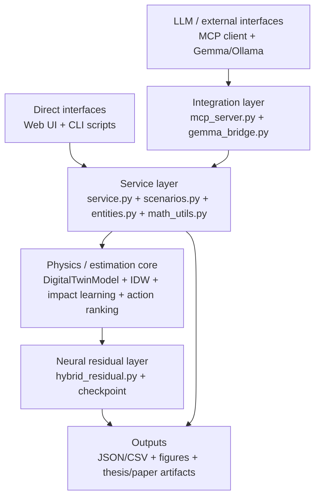
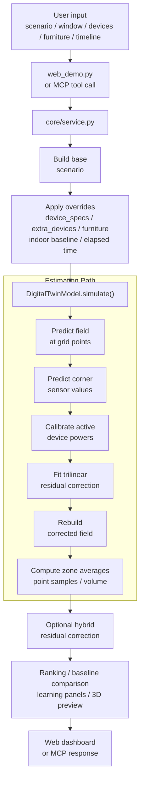
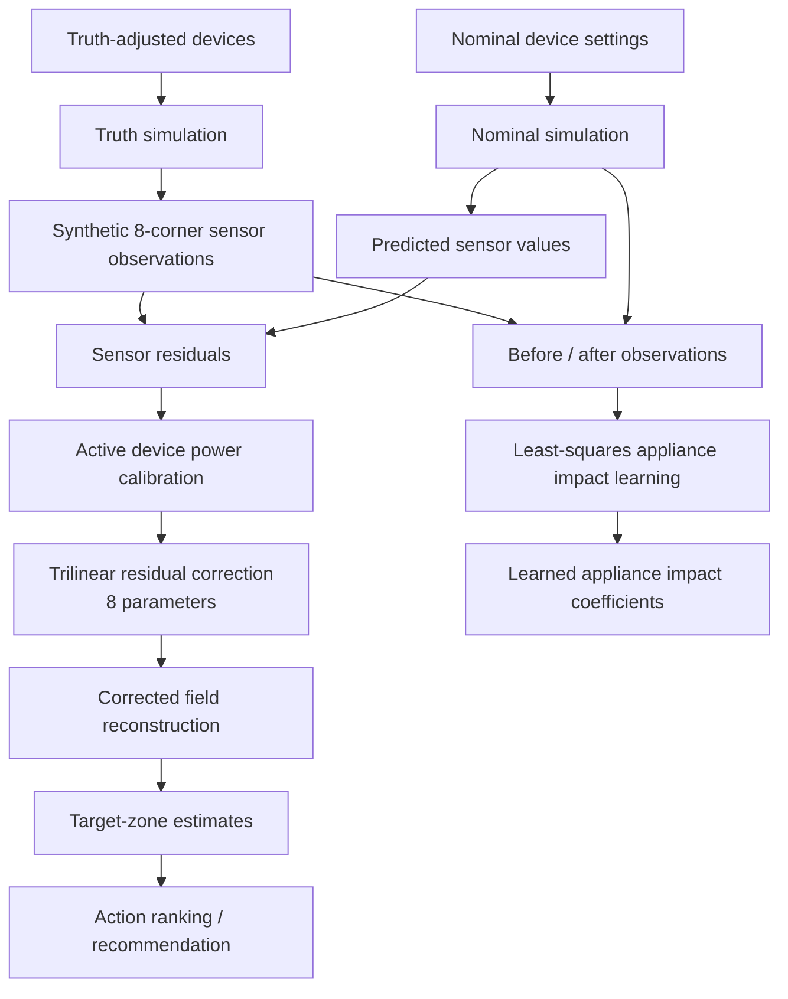
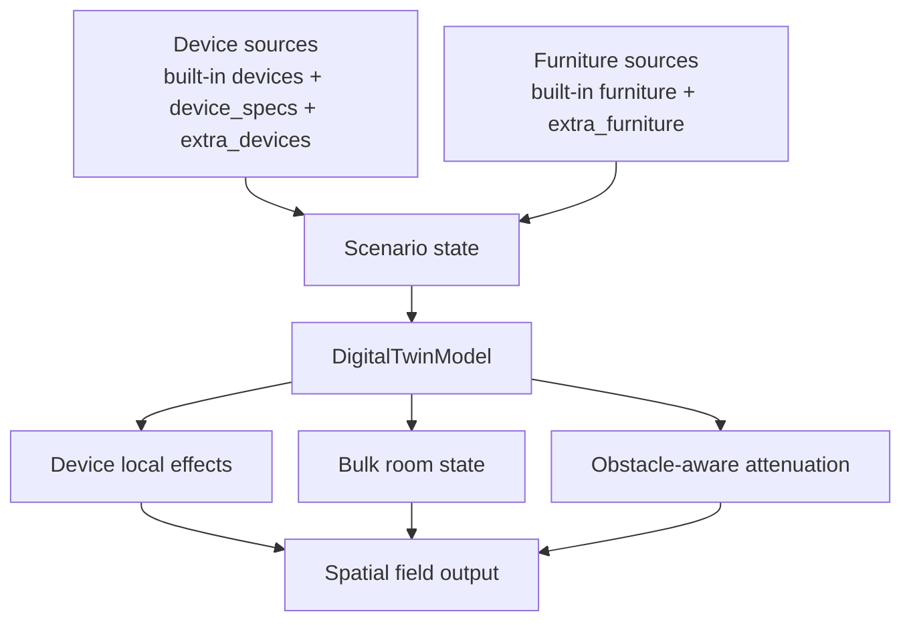
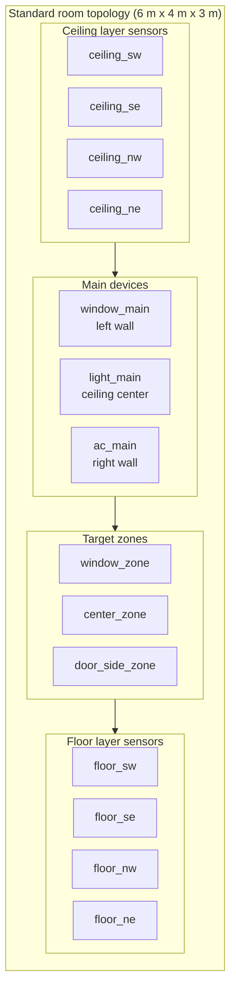
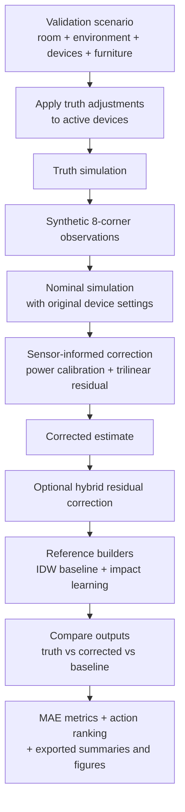
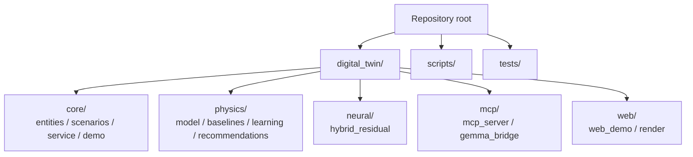
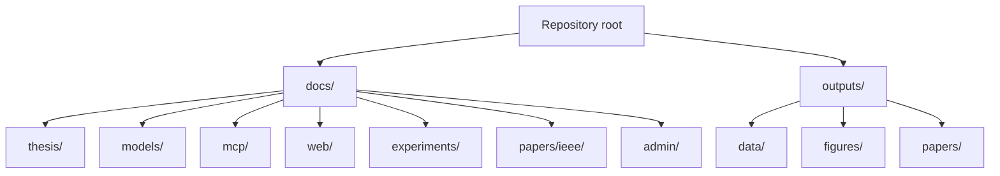

# 系統架構圖

本文件將目前單房間三因子空間數位孿生原型的實作架構整理成 GitHub 可直接顯示的 Mermaid 圖表，方便用於 README、論文方法章、口試簡報與系統說明。

## 1. 整體分層架構

## 2. 主要執行資料流

## 3. 感測器校正與學習流程

## 4. 可模組化裝置與家具架構

## 5. 房間感測器與目標區域配置

## 6. 驗證與實驗流程圖

## 7. 程式碼結構圖

## 8. 文件與輸出結構圖

## 9. 圖表使用建議

- 若要放進 GitHub repo，直接保留 Mermaid 區塊即可。
- 若要放進論文正文，建議優先使用第 1 張、第 2 張、第 3 張、第 5 張與第 6 張。
- 第 4 張適合放方法章或附錄，用來說明裝置與家具的可模組化設計。
- 第 7 張與第 8 張較適合 README、系統說明或口試備用頁，不建議放論文正文。
