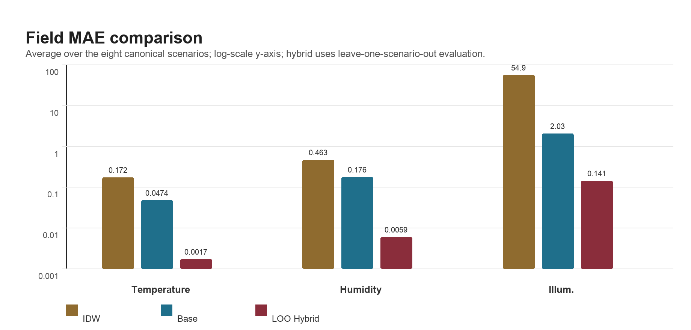

# 國立彰化師範大學

# 資訊工程學系碩士班

# 碩士論文完整版

# 單房間非連網家電環境影響學習之稀疏感測空間數位孿生原型

A Sparse-Sensing Spatial Digital Twin for Learning Environmental Impacts of Non-Networked Appliances in a Single Room

研究生：林昀佑

指導教授：易昶霈 教授、沈慧宇 副教授

版本：中文完整稿 v1.0

日期：2026 年 5 月 4 日


---


# 審定書

國立彰化師範大學資訊工程學系碩士班

碩士論文審定書

單房間非連網家電環境影響學習之稀疏感測空間數位孿生原型

研究生：林昀佑

本論文業經審查及口試合格，特此證明。

論文考試委員會召集人：

委員：

委員：

指導教授：易昶霈 博士

共同指導教授：沈慧宇 副教授

所長：

中華民國 115 年 月


---


# 誌謝

本研究能夠完成，首先感謝指導教授易昶霈教授與沈慧宇副教授在研究方向、方法與寫作上的指導與支持，以及各位口試委員的指正與建議。感謝求學過程中幫助我的各位師長所提供的學習環境，也感謝家人的支持與包容。

林昀佑 謹誌於

國立彰化師範大學資訊工程學系（所）

中華民國 115 年 5 月


---


# 摘要

智慧建築與智慧居家系統需要掌握室內環境狀態，才能支援舒適度評估、能源管理與設備控制。然而，實際房間中常見的冷氣、窗戶與照明往往沒有連網能力，也無法直接回報狀態；同時，房間內通常只能布建少量感測器，難以直接量測完整空間分布。這使得一般數位孿生若同時缺乏設備遙測與高密度量測，便難以對真實房間提供可用的環境估計與控制建議。

本研究以單一矩形房間為研究場域，提出一個基於有限角落感測器與連續影響場估計之三因子空間數位孿生原型。研究過程中，本研究先後比較純插值、僅局部影響場與資料驅動修正等作法，最終採用變數專屬的 reduced-order nominal model 作為主模型，分別以熱交換與熱源項描述溫度、以水氣交換與除濕項描述濕度、以光源幾何、遮蔽與單次漫反射描述照度，再以冷氣、窗戶與照明之參數化影響函數描述非連網裝置對不同區域的作用。系統固定使用 8 顆角落感測器，即天花板四角與地面四角，每個節點量測溫度、濕度與照度，並以感測器殘差進行主動設備 power scale 校準與 trilinear residual correction，以修正背景場與設備影響函數之偏差。在此基礎上，本研究再加入 hybrid residual neural network 延伸模組，以小型多層感知器學習主模型的剩餘誤差，而不直接取代原本的可解釋結構。

除空間場估計外，本研究亦建立裝置啟用前後感測資料之影響學習流程，透過最小平方法估計非連網裝置的環境影響係數，並根據目標區域的舒適度偏差輸出候選控制動作排序。為補足 direct source + obstruction 對照度間接回填亮度的低估，本研究另在 illuminance 路徑加入 lightweight single-bounce diffuse reflection 近似，以地板、天花板、牆面與啟用中的家具表面作為次級反射面。為提升系統可存取性，本研究另提供本地服務介面，其中包含 MCP server 與 web demo，作為同一套模型能力的工具化存取層。評估方面，本研究採分層證據設計：以 8 組標準情境、48 組窗戶矩陣、IDW baseline 比較、synthetic ablation 與 hybrid residual leave-one-scenario-out 測試支持受控條件下的完整場重建主張；以公開資料集 task-aligned benchmark 檢查外部資料相容子任務；以 7 天真實臥室快照檢查稀疏感測校正對未參與校正點位的改善。其中 base model 在標準情境下之平均 MAE 分別為溫度 0.0474、濕度 0.1765 與照度 2.0835，明顯低於 IDW baseline 的 0.1723、0.4633 與 75.0516。加入 Fourier low-pass denoising 的 hybrid residual correction 在預設 6/2 held-out split 中可將 field MAE 降至溫度 0.0023、濕度 0.0041 與照度 0.1675；8-fold leave-one-scenario-out 平均則為 0.0017、0.0055 與 0.1581。真實臥室快照驗證中，校正後 pillow 位置 MAE 由 0.8967°C、4.1286% 與 358.6392 lux 降至 0.1676°C、0.3939% 與 21.3753 lux。推薦動作目前定位為基於校正模型的反事實模擬排序；若要驗證其實際因果改善效果，需進一步執行 before/after 介入實驗。

公開資料集比較方面，本研究不是將公開資料硬解讀為完整 3D 場真值，而是把 SML2010 與 CU-BEMS 拆成公開資料本身可支援的 shared observable tasks，再以相同 chronological 70/30 split 比較 persistence、linear regression 與本研究模型映射後的 hybrid_digital_twin_readout。SML2010 共 24 個 target-horizon 任務中，本研究映射模型有 12 項取得最低 MAE，15 項勝過 linear regression，14 項勝過 persistence；其中 S3 facade event delta 在 60 分鐘 horizon 的 6 個 target 全部優於兩個 baseline。CU-BEMS 共 12 個 target-horizon 任務中，本研究映射模型有 9 項勝過 linear regression，但沒有任務勝過 persistence，顯示其優勢主要出現在具有幾何、邊界或事件結構的響應任務，而非所有高時間慣性建築時序預測任務。Web demo 也新增 Term Glossary 與 Public Dataset Comparison 區塊，使展示時可直接說明名詞、比較流程、數據來源與 claim boundary。

關鍵字：空間數位孿生、稀疏感測、非連網家電、室內環境建模、溫度、濕度、照度、角落感測器。


---


# Abstract

Smart building and smart home systems require indoor environmental awareness to support comfort assessment, energy management, and device control. In ordinary rooms, however, influential appliances such as conventional air conditioners, manual windows, and ordinary lights often expose no telemetry, while only a small number of sensors can be installed. As a result, practical room-scale digital twins must work with both sparse observations and incomplete device-state information.

This thesis proposes a sparse-sensing spatial digital twin for a single room. The final design uses variable-specific reduced-order nominal models with parameterized appliance influence functions, active-device power calibration, and trilinear residual correction from eight corner sensors: temperature is modeled through thermal exchange and heat-source terms, humidity through moisture exchange and dehumidification terms, and illuminance through source geometry, obstruction, and a lightweight one-bounce reflection approximation. The system further learns environmental impact coefficients of non-networked appliances from before-and-after sensor observations, ranks candidate control actions according to target-zone comfort improvement, and extends the base estimator with an optional hybrid residual neural correction layer instead of replacing the base model with an end-to-end black-box predictor.

The prototype is implemented in Python and exposed through a local service layer, including an MCP interface and a rotatable web demo, enabling interactive scenario queries, point-level estimation, baseline comparison, appliance-impact learning, and a 48-case window simulation matrix across time of day, weather, and season. A lightweight one-bounce diffuse reflection approximation is further added to the illuminance path so that floors, walls, ceilings, and active furniture surfaces can contribute indirect fill light without requiring full optical rendering. The evaluation separates controlled full-field evidence, public task-aligned comparisons, and real sparse-calibration checks. Across the canonical scenarios, the base model achieves average MAE of 0.0474 for temperature, 0.1765 for humidity, and 2.0835 for illuminance, compared with 0.1723, 0.4633, and 75.0516 for IDW. The hybrid residual layer with Fourier low-pass denoising on temperature and humidity residual traces further reduces default held-out field MAE to 0.0023, 0.0041, and 0.1675, while leave-one-scenario-out evaluation averages 0.0017, 0.0055, and 0.1581, respectively. A preliminary seven-day real-bedroom snapshot validation reduces pillow-point MAE from 0.8967, 4.1286, and 358.6392 to 0.1676, 0.3939, and 21.3753 for temperature, humidity, and illuminance. Action recommendations are treated as model-based counterfactual rankings; causal validation of recommendation efficacy requires a before/after intervention protocol. These results indicate that sparse corner sensing can still support an interpretable and trainable indoor twin when model structure, calibration, and learning are assigned to different layers.

For public head-to-head comparison, SML2010 and CU-BEMS are used only as task-aligned external benchmarks rather than dense 3D field ground truth. Raw public data are normalized, baseline models are evaluated on the same chronological 70/30 split, and the proposed digital twin plus hybrid residual checkpoint is mapped into a structured prior with a small linear readout head. The SML2010 comparison shows the strongest advantage on facade event delta tasks, especially the 60-minute horizon where all six S3 targets achieve the best MAE. CU-BEMS shows a different pattern: the mapped model often improves over linear regression but does not outperform persistence, which clarifies the model's claim boundary. The web demo exposes this comparison through a Public Dataset Comparison panel and includes a Term Glossary for presentation use.

Keywords: spatial digital twin, sparse sensing, non-networked appliances, indoor environment modeling, temperature, humidity, illuminance, corner sensors.


---


# 目錄

摘要……I

Abstract……II

誌謝……III

目錄……IV

表目錄……V

圖目錄……VI

第一章 緒論…… 1

  1.1 研究背景…… 1

  1.2 研究動機…… 1

  1.3 研究問題…… 2

  1.4 研究範圍與限制…… 2

  1.5 預期貢獻…… 2

第二章 文獻探討…… 3

  2.1 室內環境建模…… 3

  2.2 空間插值與場估計…… 3

  2.3 數位孿生與智慧建築…… 3

  2.4 房間尺度室內因子實驗研究…… 4

  2.5 非連網裝置影響學習…… 4

  2.6 MCP 與 AI Agent Tool Interface…… 5

  2.7 與相似研究之差異定位…… 5

  2.8 公開資料與訓練資料適用性…… 6

第三章 系統架構與數學模型…… 7

  3.1 系統架構…… 7

  3.2 房間、區域與感測器設定…… 7

  3.3 三因子場模型…… 8

    3.3.1 共用符號與 Indoor Baseline…… 8

    3.3.2 溫度場模型…… 8

    3.3.3 濕度場模型…… 8

    3.3.4 照度場模型…… 9

  3.4 設備影響函數…… 8

  3.5 感測器校正模型…… 9

    3.5.1 8 點場推估的可證明範圍…… 9

  3.6 非連網裝置影響學習…… 9

  3.7 訓練資料組裝流程…… 9

  3.8 Hybrid Residual Neural Network 延伸…… 10

  3.9 控制動作排序…… 10

  3.10 方法選擇理由與限制…… 10

第四章 系統實作與服務介面…… 11

  4.1 Python 原型…… 11

  4.2 MCP Tools…… 11

  4.3 Gemma/Ollama Bridge…… 12

  4.4 Web Demo 與展示輔助介面…… 12

第五章 模擬案例與結果分析…… 13

  5.1 標準情境設定…… 13

  5.2 場重建誤差…… 13

  5.3 IDW Baseline 比較…… 14

  5.4 消融分析與可重現性補強…… 14

  5.5 非連網裝置影響學習…… 14

  5.6 窗戶時段、天氣、季節矩陣與直接輸入…… 14

  5.7 Hybrid Residual Neural Network 結果…… 15

  5.8 真實臥室快照驗證與推薦動作驗證方法…… 16

  5.9 公開資料集執行流程與 Task-Aligned Benchmark 結果…… 17

  5.10 研究過程與實作挑戰…… 19

  5.11 可旋轉 3D 展示…… 19

第六章 結論與未來工作…… 19

  6.1 結論…… 19

  6.2 研究限制…… 19

  6.3 未來工作…… 19

參考文獻…… 20

附錄 A 原型執行方式…… 22

附錄 B Web Demo 操作與公開比較展示…… 22

附錄 C 名詞解釋…… 23

附錄 D 後續 IEEE 稿件資料來源原則…… 24


---


# 表目錄

表 2-1 相似研究差異比較…… 5

表 2-2 公開資料集概覽與適用性…… 6

表 2-3 Task-aligned benchmark 設計…… 6

表 3-1 房間與感測器設定…… 7

表 3-2 訓練資料表格說明…… 9

表 4-1 核心模組一覽…… 11

表 4-2 Web demo 展示輔助區塊…… 12

表 5-1 標準情境結果摘要…… 13

表 5-2 IDW 與本研究 field MAE 比較…… 14

表 5-3 消融實驗平均 field MAE…… 14

表 5-4 窗戶矩陣情境節選…… 15

表 5-5 Hybrid residual robustness checks…… 15

表 5-6 真實臥室快照 MAE 與分時舒適度…… 16

表 5-7 推薦動作介入驗證指標…… 17

表 5-8 公開資料集比較執行流程與 claim boundary…… 17

表 5-9 SML2010 Benchmark 代表性結果…… 18

表 5-10 CU-BEMS Benchmark 代表性結果…… 18


---


# 圖目錄

圖 3-1 系統整體分層架構…… 7

圖 3-2 主要執行資料流…… 7

圖 3-3 房間感測器與目標區域配置…… 8

圖 3-4 感測器校正與影響學習流程…… 9

圖 5-1 驗證與實驗流程…… 13

圖 5-2 三裝置同時作用溫度場 3D 點雲（all_active）…… 13

圖 5-3 僅冷氣作用溫度場 3D 點雲（ac_only）…… 14

圖 5-4 僅燈具作用照度場 3D 點雲（light_only）…… 14

圖 5-5 IDW、Base 與 LOO Hybrid field MAE 比較…… 15

圖 5-6 三裝置全開溫度場 3D 點雲（5.11 節）…… 19

圖 5-7 僅開窗溫度場 3D 點雲（window_only）…… 18

圖 5-8 僅燈具照度場 3D 點雲（light_only，5.11 節）…… 19


---


# 第一章 緒論

## 1.1 研究背景

智慧家庭與智慧建築系統逐漸被用於室內環境監控、能源管理與舒適度控制。這類系統通常需要知道空間中溫度、濕度與照度的分布，才能判斷使用者所在區域是否過熱、過暗或過於潮濕。然而，實際房間內不可能在每一個位置都布建感測器，因此系統往往只能取得少量離散點位資料。若僅依賴單點或少數點位量測，容易忽略同一空間中不同區域的環境差異。

另一方面，許多既有家電並不是智慧裝置。傳統冷氣、一般開關照明或手動窗戶可能無法連網，也無法主動回報開關狀態、出力或作用範圍。這些裝置雖然無法被直接讀取，卻會持續改變室內環境。若數位孿生模型只依賴智慧裝置 API，將無法完整描述一般房間中的環境變化。因此，本研究關注的核心問題是：如何透過有限感測器觀測資料，學習非連網裝置對空間環境造成的影響，並將此學習結果用於更準確的三因子控制推薦。

## 1.2 研究動機

在原型開發初期，本研究曾嘗試將問題簡化為角落感測器插值或純局部影響場疊加，但很快發現兩個問題。第一，若只靠插值，模型雖能平滑填補空間，卻無法表達冷氣出風方向、窗邊日照或燈具位置等設備語意；第二，若只做局部場疊加，則容易出現設備附近變化明顯、全室平均狀態卻不合理的結果。這些實作經驗直接促成後續的變數專屬 nominal model、感測器校正流程，以及只把神經網路放在 residual correction 層的設計。

- 只知道角落感測器數值時，仍需要估計房間中央、靠窗區與門側區的三因子狀態。
- 裝置沒有連網時，仍希望從環境變化中推估它是否對空間造成影響。
- 新增或啟用冷氣、窗戶、照明後，系統應能估計其對不同區域造成的變化。
- 學習裝置影響後，模型應能支援開冷氣、開窗或開燈等候選控制動作排序。
- 將模型封裝為標準化工具介面後，AI client 或 agent 可查詢與使用數位孿生能力。

## 1.3 研究問題

- RQ1：在只有 8 顆角落感測器的條件下，是否能建立單房間溫度、濕度與照度的空間估計模型？
- RQ2：在家電或環境裝置沒有連網狀態回報的情況下，是否能從環境感測資料學習其對空間不同區域的影響？
- RQ3：學習後的裝置影響模型，是否能依三因子偏差輸出候選控制動作排序，例如選擇開冷氣、開窗或開燈，且推薦動作的實際可行性應如何透過介入式 before/after 實驗驗證？
- RQ4：將數位孿生模型封裝為標準化工具介面後，是否能讓 AI client 查詢、模擬與使用控制推薦能力？

## 1.4 研究範圍與限制

- 研究場域固定為單一矩形房間，不處理多房間或跨空間空氣交換。
- 感測器配置固定為天花板四角與地面四角，共 8 顆角落節點。
- 設備類型聚焦於冷氣、窗戶與照明。
- 模型為簡化動態模型，不追求 CFD 等級高精度流場。
- 濕度保留於模型中，但作為次核心變數處理。
- 控制功能只做候選動作排序，不做自動閉環控制；推薦動作的真實因果效果需透過後續介入實驗驗證。
- MCP 部分定位為本地 stdio server 與 AI-agent-accessible interface，不宣稱提出新的 MCP protocol。

## 1.5 預期貢獻

- 提出一個以單房間、8 顆角落感測器為前提的三因子空間數位孿生原型，明確描述 temperature、humidity 與 illuminance 場。
- 建立包含變數專屬 nominal model、active device power calibration、trilinear correction 與裝置影響學習的可解釋估測流程。
- 建立訓練資料組裝與 hybrid residual correction 路線，使真實感測資料可用於參數校正、影響學習與殘差修正，而非直接取代主模型。
- 提出可對接 MCP、Web demo 與公開資料集 task-aligned benchmark 的研究原型與評估框架，並明確區分 synthetic full-field、real sparse calibration、public task-aligned benchmark 與 intervention validation 各自支援的主張範圍。


---


# 第二章 文獻探討

## 2.1 室內環境建模

室內環境建模的主要目的，在於描述空間中熱舒適、能源使用與設備控制之間的關係。高精度方法如 computational fluid dynamics（CFD）雖可細緻描述空氣流動、傳熱與邊界交換，但通常需要大量幾何細節、材料參數與邊界條件，計算成本亦相對較高。相較之下，reduced-order model、grey-box thermal model 與控制導向動態模型著重於以較少參數捕捉主要動態，並保留參數辨識與即時推估能力，因此更適合用於建築控制、預測與數位孿生原型 [1][2][3]。基於此，本研究不追求 CFD 等級的高解析流場，而採用偏向控制導向與可解釋性的簡化空間模型。

## 2.2 空間插值與場估計

在感測器數量有限的情況下，最直接的方法是使用空間插值估計未量測位置。本研究採用 inverse distance weighting（IDW）作為 baseline。IDW 的優點是實作簡單且不依賴設備先驗，但其估計完全由量測點距離決定，無法反映冷氣出風方向、窗戶位置、照明熱源或設備作用範圍等結構資訊。相較之下，zonal model、reduced-order model 與 hybrid spatial model 提供了介於 well-mixed room model 與 CFD 之間的折衷途徑，可在維持較低計算成本的同時保留主要空間差異 [4][5][6]。因此，本研究不是把同一個 bulk/local 物理假設套用到所有環境量，而是將主模型拆成變數專屬 nominal model：溫度採熱交換與熱源近似，濕度採水氣交換與除濕近似，照度採光源幾何、遮蔽與反射近似；三者再共用稀疏感測 residual correction 框架。

## 2.3 數位孿生與智慧建築

數位孿生通常被視為實體系統在數位空間中的動態對應模型，其核心價值在於將感測資料、系統狀態與分析模型整合為可更新、可查詢且可推估的數位映射。在智慧建築領域中，數位孿生常與 BIM、IoT 感測、設備監控與能源管理系統結合，用於營運最佳化與狀態預測。近年的建築數位孿生回顧指出，多數研究著重於平台架構、資料整合與建築尺度的決策支援，但對於少量感測器條件下之單房間空間場重建與設備影響推估，討論仍相對有限 [7]。因此，本研究的定位並非建構完整 BIM/BMS 平台，而是針對單房間、低成本感測器與非連網裝置場景提出一個可運作的簡化數位孿生原型。

## 2.4 房間尺度室內因子實驗研究

若將文獻範圍收斂到房間尺度的實驗研究，可以發現溫度、濕度與照度並不是彼此孤立的環境因子。Chinazzo 等人以 office-like test room 為實驗場域，控制不同室溫與日光照度條件，研究 visual perception 與 thermal perception 之間的交互作用，指出日照與室溫會共同影響受試者的感知結果 [18][19]。Lan 等人則在教室條件下同時調整熱環境與照明參數，分析其對學習表現與主觀感受的影響，顯示 thermal and visual environments 可在同一受控場域中被聯合操控與評估 [20]。這類研究雖不以數位孿生為主，但提供了重要前提：房間內三因子至少在實驗設計層級上具備共同量測與共同分析的必要性。

另一類與本研究更接近的工作，是冷氣、開窗或通風策略對房間環境的實驗或現地量測。Kuwahara 等人在大學實驗室中比較空調運轉與自然通風策略，量測溫度、相對濕度與 CO2 變化，用於評估室內環境與舒適 [21]。Zhou 等人則對綠建築辦公室進行長期 field study，追蹤 thermal environment、relative humidity、CO2 與 visual environment，並結合使用者滿意度調查 [22]。Wang 等人針對寒冷地區住宅建築的冬季室內環境品質進行實測，指出低能耗住宅中的室溫與相對濕度仍可能出現不理想分布 [23]。這些研究共同說明，房間尺度的 IEQ 實驗並不罕見，而且冷氣、通風與外氣條件確實會使房間內部環境產生可量測差異。

然而，現有房間尺度實驗研究多半聚焦於舒適評估、單一場域量測，或多因子對認知與滿意度的影響，較少進一步處理有限感測器下的空間場重建、非連網裝置影響學習，以及可被外部 AI 系統查詢的工具化服務。Geng 等人對綠建築辦公室進行大規模與長期 IEQ 比較，Lee 等人則分析研究機構中不同工作型態與 IEQ 的關係 [24][25]；這些研究證明房間內溫度、濕度、照度與舒適度之間具有實際研究基礎，但尚未形成單房間、三因子、8 顆角落感測器、設備影響學習與控制推薦整合於同一原型的做法。基於此，本研究並非宣稱房間室內因子實驗是全新問題，而是主張：本研究將既有 IEQ 實驗研究常見的環境因子量測，進一步推展為可估場、可校正、可學習與可服務化的單房間數位孿生方法。

## 2.5 非連網裝置影響學習

既有智慧家庭與智慧建築研究，常預設設備可由網路介面直接讀取或控制。然而在一般居住空間中，傳統冷氣、手動窗戶與一般照明往往不具備可直接讀取的連網能力。此時，若系統仍希望掌握設備對環境的作用，就必須從感測到的環境變化反推設備影響。近期研究顯示，有限感測器搭配 data assimilation、hybrid model 或感測配置分析，確實能對室內溫濕度場進行重建，並評估量測點配置對重建品質的影響 [5][8][9]。本研究延續此方向，將裝置啟用前後的感測器差異視為學習訊號，並利用裝置空間影響基底與最小平方法估計其對溫度、濕度與照度的影響係數，以支援後續的場估計與控制推薦。

## 2.6 MCP 與 AI Agent Tool Interface

Model Context Protocol（MCP）提供一種標準化工具介面，使外部模型或 AI client 能以一致方式呼叫系統能力。本研究將數位孿生原型封裝為本地 MCP server，使情境查詢、場估計、動作排序、點位取樣與窗戶條件模擬等功能，可被 AI agent 直接使用。需要強調的是，MCP 在本研究中的角色屬於系統整合與工具化封裝，用以驗證數位孿生模型可被外部 AI 系統操作，而非針對 MCP 通訊協定本身提出新方法。

## 2.7 與相似研究之差異定位

若從研究方法的相似性來看，本研究最接近的文獻不是一般性的 building digital twin 平台論文，而是有限感測器室內場重建、控制導向簡化熱模型，以及 hybrid thermal surrogate 這三類研究。Qian 等人以資料同化方法重建實際住宅房間中的溫濕度分布，重點在於以有限量測重建連續場並分析量測配置 [8]；Huljak 等人聚焦於空調房間中的 hybrid 溫度模型，強調以 physics-based 與 surrogate model 共同描述空調空間中的溫度分布 [5]；Megri 等人則以 DOMA 動態 zonal model 處理時間變化與熱舒適預測 [6]。這三類工作與本研究皆有明顯關聯，但關注點不同。

本研究的具體定位是：在不做 CFD、不追求完整 BIM 平台，也不假設家電可回報狀態的前提下，建立一個可由 8 顆角落感測器校正、可學習非連網裝置影響、並可透過 MCP 與 Web 互動使用的單房間三因子數位孿生原型。換言之，本研究刻意把問題收斂在「單房間、有限角落感測器、溫濕度照度三因子、非連網家電影響學習、控制推薦、可工具化服務」這個組合上。從目前檢視到的相似研究來看，尚未看到與本研究完全同構的公開論文。

| 研究 | 相似處 | 主要差異 |
| --- | --- | --- |
| Qian et al. (2025) [8] | 有限觀測下重建室內溫濕度分布 | 未把照度、非連網家電影響學習與 MCP 工具化整合在同一系統 |
| Huljak et al. (2025) [5] | 使用 hybrid 溫度模型處理空調房間 | 主變數偏溫度，且依賴較強的建物邊界條件與物理模擬流程 |
| Megri et al. (2022) [6] | 強調動態 zonal / transient prediction | 目標偏熱舒適分析，不處理照度與非連網裝置學習 |
| Chen & Wen (2007) [9] | 討論感測器配置與 zonal model | 重點在感測器設計，不是建立可互動的單房間數位孿生原型 |
| Cespedes-Cubides & Jradi (2024) [7] | 界定 building digital twin 的整體脈絡 | 屬綜述，不提供本研究這種單房間三因子可執行原型 |

## 2.8 公開資料與訓練資料適用性

若從資料角度來看，公開資料集確實可作為本研究的輔助比對來源，但沒有任何一套資料能直接等價取代本研究的標準情境。原因在於，本研究同時要求單房間空間拓樸、8 顆角落感測器前提、三因子場估計、冷氣/窗戶/照明的裝置狀態，以及可移動家具阻擋。現有公開資料大多只滿足其中一部分。

| 資料集 | 可用欄位 | 適合用途 | 限制 |
| --- | --- | --- | --- |
| CU-BEMS [12] | 溫度、濕度、照度、AC/lighting power、zone-level series | 可用於驗證裝置狀態與環境量測的時間關聯 | 多區商辦資料，不是單房間 8 角落感測器拓樸 |
| Appliances Energy Prediction [13] | 多房間溫溼度、室外氣象、燈光用電 | 可用於室內外條件與用電關聯分析 | 缺空間幾何與單房間場分布標記 |
| SML2010 [14] | 兩處室內溫度/濕度/照度、日照與室外條件 | 可用於窗戶日照與室內響應的時序比對 | 量測點有限，且非完整單房間空間場 |
| Occupancy Detection [15] | 溫度、濕度、照度、CO2 | 可用於感測器前處理與環境變化偵測 | 不含裝置資訊與空間拓樸 |
| Denmark IEQ dataset [16] | 房間層級 operative temperature、RH、CO2、occupancy | 可用於真實住宅 IEQ 波動比對 | 缺照度與設備狀態 |
| ASHRAE Global Thermal Comfort Database II [17] | 大規模熱舒適與環境量測 | 可用於舒適目標與控制評分合理性參考 | 不是空間場重建資料，也不對應單房間幾何 |

因此，本研究目前採取的資料策略是：以可控制的模擬情境作為主要訓練與驗證來源，以公開資料集作為外部合理性檢查與未來真實資料接軌的準備。具體而言，若要替本研究的 hybrid residual neural network 增加真實資料，現階段最有價值的是 CU-BEMS、SML2010 與住宅 IEQ 類資料；若要補強舒適度控制目標的依據，則 ASHRAE Global Thermal Comfort Database II 比較適合作為外部參考。

具體而言，本研究可採兩層 benchmark 設計。第一層是 canonical synthetic benchmark，直接使用本研究的 8 組標準情境與 48 組窗戶矩陣，讓主模型、IDW baseline、移除設備先驗的純資料驅動模型，以及 hybrid residual correction 在完全相同的輸入、感測器配置與 ground truth 下比較 field MAE、zone MAE、sensor MAE 與推薦改善分數。第二層是 public task-aligned benchmark，亦即把公開資料集拆成與本研究相容的子任務：CU-BEMS 可用於比較 AC/lighting 事件前後的 zone-level temperature、humidity、illuminance 響應；SML2010 可用於比較窗戶/日照相關的溫濕度照度時序響應；Denmark IEQ 與 ASHRAE Global Thermal Comfort Database II 則適合比較舒適度目標函數、偏差分數或分類準確率。

除上述兩層 benchmark 外，推薦動作本身仍需要第三層介入式驗證。此層不再只比較模型估測誤差，而是要求研究者實際執行系統排序第一的動作，並量測介入前後目標位置或目標區域的 comfort penalty 是否下降。換言之，場估計驗證回答「模型是否看得準」，介入驗證則回答「模型建議的動作是否真的讓房間更接近舒適目標」。

| benchmark 層級 | 資料來源 | 比較任務 | 本研究模型模式 | 建議指標 |
| --- | --- | --- | --- | --- |
| canonical synthetic | 8 組標準情境 | 完整場重建、裝置影響學習、推薦排序 | full spatial mode | field MAE、zone MAE、sensor MAE、improvement score |
| canonical synthetic | 48 組窗戶矩陣 | 外部邊界條件敏感度分析 | full spatial window mode | field MAE、zone deviation、趨勢一致性 |
| public task-aligned | CU-BEMS | AC 與照明事件後的區域響應 | single-zone dataset-compatible mode | MAE、RMSE、delta MAE、correlation |
| public task-aligned | SML2010 | 兩點日照與外氣條件響應 | two-point dataset-compatible mode | MAE、RMSE、delta MAE |
| public task-aligned | Denmark IEQ / ASHRAE | 舒適度評分與控制目標合理性 | comfort-only mode | score error、accuracy、F1、AUROC |


---


# 第三章 系統架構與數學模型

## 3.1 系統架構

本研究系統由五個主要模組組成：房間與設備設定、三因子影響場模型、角落感測器校正、非連網裝置影響學習、以及控制動作排序與 MCP 工具介面。整體流程為：輸入房間幾何、設備位置與外部環境條件後，模型先建立背景場，再加入設備影響函數，接著使用 8 顆角落感測器觀測值校準 active device power scale 並建立 trilinear 校正場，最後輸出任意座標或目標區域的三因子估計與候選控制動作排序。


*圖 3-1 系統整體分層架構。此圖說明人機互動或 AI 工具呼叫如何經由服務編排層進入環境數位孿生核心、校正與影響學習層，以及 optional residual neural layer，最後輸出空間估測與控制建議。*


*圖 3-2 主要執行資料流。此圖對應一次 scenario 評估如何從輸入設定、場估計、校正、到 dashboard 與 MCP 輸出。*

## 3.2 房間、區域與感測器設定

標準房間尺寸設定為寬 6.0 m、長 4.0 m、高 3.0 m。感測器固定於地面四角與天花板四角，共 8 顆節點。每個節點皆假設可量測 temperature、humidity 與 illuminance。區域劃分包含 window_zone、center_zone 與 door_side_zone，用於比較不同空間區域受到設備影響的差異。

| 項目 | 設定 |
| --- | --- |
| 房間尺寸 | 6.0 m × 4.0 m × 3.0 m |
| 感測器數量 | 8 顆角落節點 |
| 採樣網格 | 16 × 12 × 6 |
| 三個環境因素 | Temperature, Humidity, Illuminance |
| 主要區域 | window_zone, center_zone, door_side_zone |
| 設備類型 | ac_main, window_main, light_main |


*圖 3-3 房間感測器與目標區域配置。8 顆角落感測器、3 個主要區域與 3 個核心裝置共同構成單房間數位孿生的標準拓樸。*

## 3.3 三因子場模型

本研究將室內狀態定義為三個空間與時間函數：

$$T(\mathbf{p},t),\quad H(\mathbf{p},t),\quad L(\mathbf{p},t)$$

為避免把不同物理性質的環境量硬套到同一個公式，本研究將估測流程拆成兩層。第一層是依變數而異的 nominal model $N_v(\mathbf{p},t)$，負責描述該變數的主要物理趨勢；第二層是由 8 顆角落感測器提供的 residual correction $C_v(\mathbf{p},t)$，負責吸收低階空間偏差。因此任一環境因素 $v\in\{T,H,L\}$ 的最終估計值皆寫成：

$$\hat{F}_v(\mathbf{p},t)=N_v(\mathbf{p},t)+C_v(\mathbf{p},t)$$

### 3.3.1 共用符號與 Indoor Baseline

其中 $T$ 代表 temperature，$H$ 代表 relative humidity，$L$ 代表 illuminance。$C_v$ 的三線性形式在 3.5 節定義；本節先定義三個不同的 nominal model。為了讓公式可讀，本研究先定義共用的幾何與裝置符號。令查詢點為 $\mathbf{p}=(x,y,z)$，房間高度為 $H_r$，則正規化垂直位置為：

$$\zeta=\frac{z}{H_r}-\frac{1}{2}$$

本節公式中的 baseline 指的是 indoor baseline，即房間在目標設備作用尚未加入、且尚未套用角落感測器 residual correction 前的室內基準狀態，不是第 5 章用來比較方法優劣的 IDW baseline，也不是公開資料集中的 persistence 或 linear regression baseline。具體而言，本研究將室內基準狀態寫成：

$$\mathbf{b}_0=(T_0,H_0,L_0)$$

$T_0$、$H_0$ 與 $L_0$ 分別代表該次情境的起始室內溫度、相對濕度與照度。若有真實部署資料，且可取得設備啟用前或查詢前的穩定參考時間 $t_{\mathrm{ref}}$，則可由 8 顆角落感測器的平均值初始化：

$$\begin{aligned}T_0&=\frac{1}{|\mathcal{S}|}\sum_{s\in\mathcal{S}}O_T(\mathbf{p}_s,t_{\mathrm{ref}}),\\H_0&=\frac{1}{|\mathcal{S}|}\sum_{s\in\mathcal{S}}O_H(\mathbf{p}_s,t_{\mathrm{ref}}),\\L_0&=\frac{1}{|\mathcal{S}|}\sum_{s\in\mathcal{S}}O_L(\mathbf{p}_s,t_{\mathrm{ref}})\end{aligned}$$

其中 $\mathcal{S}$ 為 8 顆角落感測器集合，$O_v$ 為實際觀測值。若沒有啟用前觀測資料，則 baseline 由房間設計檔或情境設定提供；本研究標準房間預設為 $T_0=29.0^\circ\mathrm{C}$、$H_0=67.0\%$、$L_0=90.0$ lux。Web demo 左側的 Indoor Baseline 欄位即是讓使用者直接指定這三個基準值。後續所有冷氣、窗戶與照明項，都是在此室內基準狀態上增加或減少的偏移量。

第 $j$ 個裝置的時間啟用量與空間影響 envelope 分別定義為：

$$A_j(t)=a_j\left(1-e^{-t/\tau_j}\right)$$

$$\begin{aligned}E_j(\mathbf{p},t)&=A_j(t)R_j(\mathbf{p})D_j(\mathbf{p},t)V_j(\mathbf{p}),\\R_j(\mathbf{p})&=\exp(-\|\mathbf{p}-\mathbf{p}_j\|/r_j)\end{aligned}$$

$A_j(t)$ 描述裝置由剛啟動到接近準穩態的時間響應；$R_j$ 是距離衰減；$D_j$ 是方向性項，例如冷氣出風方向或燈具照射方向；$V_j$ 是家具或牆面造成的可見性／遮蔽項；$r_j$ 是裝置影響半徑。這個 envelope 是三個變數共用的空間結構，但各變數如何使用它並不相同。

| 符號 | 意義 |
| --- | --- |
| $T_0,H_0,L_0$ | Indoor baseline，即設備作用與 residual correction 前的起始室內溫度、相對濕度與照度 |
| $T_{\mathrm{out}},H_{\mathrm{out}},S_{\mathrm{out}}$ | 室外溫度、室外相對濕度與外部日照照度 |
| $P_j$ | 第 $j$ 個裝置的 power scale，可由感測資料校正 |
| $k^{g},k^{s}$ | 全室平均響應與空間局部響應的簡化增益係數 |
| $M(t)$ | 房間混合係數，用於控制垂直分層強度 |
| $C_v(\mathbf{p},t)$ | 由 8 顆角落感測器 residual 形成的三線性校正場 |

### 3.3.2 溫度場模型

溫度場的 nominal model 採用熱交換與熱源近似，先分成 indoor baseline、全室平均響應、局部空間響應與垂直分層四個部分：

$$\begin{aligned}N_T(\mathbf{p},t)=T_0+B_T(t)+S_T(\mathbf{p},t)+\gamma_T M(t)\zeta\end{aligned}$$

$$\begin{aligned}B_T(t)=&\,B_{\mathrm{ac},T}(t)+B_{\mathrm{win},T}(t)+B_{\mathrm{light},T}(t),\\S_T(\mathbf{p},t)=&\,S_{\mathrm{ac},T}(\mathbf{p},t)+S_{\mathrm{win},T}(\mathbf{p},t)+S_{\mathrm{light},T}(\mathbf{p},t)\end{aligned}$$

其中 $B_T$ 表示全室平均熱響應，$S_T$ 表示設備附近的局部熱影響，$\gamma_T M(t)\zeta$ 表示垂直溫度分層。三個主要裝置的溫度項可展開為：

$$\begin{aligned}B_{\mathrm{ac},T}(t)&=s_m k_{\mathrm{ac},T}^{g}d_TP_{\mathrm{ac}}A_{\mathrm{ac}}(t),\\S_{\mathrm{ac},T}(\mathbf{p},t)&=s_m k_{\mathrm{ac},T}^{s}d_TP_{\mathrm{ac}}E_{\mathrm{ac}}(\mathbf{p},t)\end{aligned}$$

$$\begin{aligned}B_{\mathrm{win},T}(t)&=k_{\mathrm{win},T}^{g}(T_{\mathrm{out}}-T_0)P_{\mathrm{win}}A_{\mathrm{win}}(t),\\S_{\mathrm{win},T}(\mathbf{p},t)&=k_{\mathrm{win},T}^{s}(T_{\mathrm{out}}-T_0)P_{\mathrm{win}}E_{\mathrm{win}}(\mathbf{p},t)\end{aligned}$$

$$\begin{aligned}B_{\mathrm{light},T}(t)&=k_{\mathrm{light},T}^{g}P_{\mathrm{light}}A_{\mathrm{light}}(t),\\S_{\mathrm{light},T}(\mathbf{p},t)&=k_{\mathrm{light},T}^{s}P_{\mathrm{light}}E_{\mathrm{light}}(\mathbf{p},t)\end{aligned}$$

其中 $s_m$ 由冷氣模式決定，冷房或除濕時為負，加熱時為正，送風模式不產生全室熱量變化；$d_T$ 代表冷氣設定溫度與室內基準溫度形成的需求量。此式的重點是：溫度使用熱交換與熱源項，不使用照度的光學項。

### 3.3.3 濕度場模型

濕度場的 nominal model 不直接套用熱場公式，而是使用水氣交換與冷氣除濕近似。其結構同樣分成 indoor baseline、全室平均響應、局部空間響應與垂直濕度梯度：

$$\begin{aligned}N_H(\mathbf{p},t)=\mathrm{clip}_{[0,100]}\{H_0+B_H(t)+S_H(\mathbf{p},t)-\gamma_H M(t)\zeta\}\end{aligned}$$

$$\begin{aligned}B_H(t)=&-k_{\mathrm{ac},H}^{g}d_HP_{\mathrm{ac}}A_{\mathrm{ac}}(t)+k_{\mathrm{win},H}^{g}(H_{\mathrm{out}}-H_0)P_{\mathrm{win}}A_{\mathrm{win}}(t),\\S_H(\mathbf{p},t)=&-k_{\mathrm{ac},H}^{s}d_HP_{\mathrm{ac}}E_{\mathrm{ac}}(\mathbf{p},t)+k_{\mathrm{win},H}^{s}(H_{\mathrm{out}}-H_0)P_{\mathrm{win}}E_{\mathrm{win}}(\mathbf{p},t)\end{aligned}$$

其中 $H_0$ 為室內基準相對濕度，$H_{\mathrm{out}}$ 為室外相對濕度，$d_H$ 為除濕需求量。冷氣項為負值，表示除濕；窗戶項由 $(H_{\mathrm{out}}-H_0)$ 決定正負，表示外氣較濕時提高室內濕度，外氣較乾時降低室內濕度。此處並未主張完整求解水氣質量守恆或 psychrometric model，而是使用控制導向的低階近似，再交由角落感測器 residual 校正吸收模型偏差。

### 3.3.4 照度場模型

照度場的 nominal model 採用光源、日照、遮蔽與反射近似，不使用溫濕度的全室混合項：

$$N_L(\mathbf{p},t)=\max\{0,L_0+L_{\mathrm{win}}^{\mathrm{dir}}(\mathbf{p},t)+L_{\mathrm{light}}^{\mathrm{dir}}(\mathbf{p},t)+L_{\mathrm{win}}^{\mathrm{amb}}(\mathbf{p},t)+I^{\mathrm{refl}}(\mathbf{p},t)\}$$

$$\begin{aligned}L_{\mathrm{win}}^{\mathrm{dir}}(\mathbf{p},t)&=S_{\mathrm{out}}d_f k_{\mathrm{sol}}P_{\mathrm{win}}E_{\mathrm{win}}(\mathbf{p},t),\\L_{\mathrm{light}}^{\mathrm{dir}}(\mathbf{p},t)&=G_{\mathrm{light}}P_{\mathrm{light}}E_{\mathrm{light}}(\mathbf{p},t),\\L_{\mathrm{win}}^{\mathrm{amb}}(\mathbf{p},t)&=\beta_{\mathrm{amb}}L_0P_{\mathrm{win}}A_{\mathrm{win}}(t)\exp(-\|\mathbf{p}-\mathbf{p}_{\mathrm{win}}\|/(1.8r_{\mathrm{win}}))\end{aligned}$$

其中 $L_0$ 為室內基準照度，$S_{\mathrm{out}}$ 為外部日照照度，$d_f$ 為 daylight factor，$k_{\mathrm{sol}}$ 為窗戶日照增益，$G_{\mathrm{light}}$ 為燈具照度增益，$\beta_{\mathrm{amb}}$ 為窗邊散射背景光係數。$I^{\mathrm{refl}}$ 是 3.4 節定義的 single-bounce diffuse reflection。照度模型的重點在於光源位置、方向性、距離衰減、遮蔽與表面反射，因此它與溫度、濕度的熱交換或水氣交換公式不同。

因此，本研究的主張不是「溫度、濕度、照度都遵守同一套 bulk + local 物理定律」，而是「三種變數各自先由符合其物理特性的低階 nominal model 產生估計，再共用 8 點 sparse-sensor residual correction」。這樣可同時保留可解釋性、低運算成本，以及由真實感測資料校正的能力。

## 3.4 設備影響函數

- 冷氣：主要造成局部降溫，並帶有弱除濕效果；3D 視覺化中以牆面橫條表示。
- 窗戶：受外部溫度、外部濕度與日照條件影響，同時改變三個環境因素；3D 視覺化中以牆面矩形表示。
- 照明：主要提升照度，並產生少量熱效應；3D 視覺化中以點狀標記表示。

對照度而言，若只使用窗戶與照明的直接項，再乘上遮蔽衰減，常會低估牆面、地板與家具附近的間接回填亮度。若改用完整 radiosity 或 ray tracing，則需要更細的表面材質、反射模型與幾何資訊，且計算成本明顯提高，與本研究稀疏感測、低成本原型的定位不符。因此本研究僅在 illuminance 路徑加入一個 lightweight single-bounce diffuse reflection 近似：

$$I^{\text{refl}}(\mathbf{p},t) = \sum_{s} \rho_s \bar{I}_s A_s^{\text{rel}} e^{-\|\mathbf{p}-\mathbf{c}_s\|/\ell_s} \max(0,\,\mathbf{n}_s \cdot \hat{\mathbf{r}}_{s\to p})\, V_s(\mathbf{p})$$

其中 $s$ 代表 floor、ceiling、四面牆與啟用中的家具表面；$\rho_s$ 為表面反射率；$\bar{I}_s$ 為該表面中心由 direct light 接收到的照度；$A_s^{\text{rel}}$ 為正規化後的面積因子；$\ell_s$ 為衰減長度；$V_s(\mathbf{p})$ 則延用既有遮蔽邏輯。這個公式的目的不是做高保真光學渲染，而是在不引入完整光傳輸模擬的前提下，補足 direct light 對 indirect fill light 的低估。

換言之，本研究對 illuminance 的設計取捨是：保留 direct source、directionality 與 obstruction 的可解釋結構，再另外加上一個單次漫反射近似，使牆、地板、天花板與家具能作為次級發光面回填照度。這樣既能維持與現有影響場模型一致的參數化形式，也比 full radiosity 更適合目前的單房間數位孿生原型。

## 3.5 感測器校正模型

模型先預測 8 顆角落感測器位置的三因子值，再與觀測值比較得到殘差。為提高環境估計精度，系統先以最小平方法估計 active device 的 power scale，使設備影響函數更接近觀測資料；接著對每一個環境因素，以 8 參數 trilinear correction 擬合角落殘差：

$$C(\mathbf{p}) = c_0 + c_1 X + c_2 Y + c_3 Z + c_4 XY + c_5 XZ + c_6 YZ + c_7 XYZ$$

其中 X、Y、Z 為正規化後的房間座標。相較於一階 affine surface，trilinear correction 可使用 8 個角點支撐 8 個校正係數，除了整體偏移與一階梯度外，也能表示角落之間的交互變化。不過此方法仍無法重建任意高頻局部變化，因此其定位仍是低成本、可解釋的場校正方法。

### 3.5.1 8 點場推估的可證明範圍

本研究必須先區分「取得資料」與「推估資料」：8 顆角落感測器以外的位置並沒有被直接量測，系統輸出的其他採樣點數值是由物理先驗模型加上角落 residual correction 推估而得。因此，本研究不宣稱只靠 8 點可以無條件還原任意真實室內場；可嚴謹證明的是，在明確模型假設下，8 個角點可唯一決定一個三線性 residual correction，且該 correction 對三線性 residual 完全正確，對平滑 residual 則具有可寫出的誤差界。

首先說明不可證明的部分。若不對真實場加入任何平滑性、物理模型或函數族假設，僅由 8 個角落值無法唯一決定房間內任一非角落點的值。理由是：對任一非感測點 $\mathbf{p}^{*}$，可構造一個連續 bump function $g(\mathbf{p})$，使其在 8 個角落皆為 0，但在 $\mathbf{p}^{*}$ 為 1。則任意一個場 $f(\mathbf{p})$ 與另一個場 $f(\mathbf{p})+\alpha g(\mathbf{p})$ 在 8 顆感測器上完全相同，卻在 $\mathbf{p}^{*}$ 相差 $\alpha$。因此，若沒有額外假設，任何演算法都無法由同一組 8 點觀測唯一判斷 $\mathbf{p}^{*}$ 的真值。這也說明本研究必須把主張寫成條件式推估，而不是任意場重建定理。

在本研究的條件式模型中，令房間為 $\Omega=[0,W]\times[0,L]\times[0,H]$，正規化座標為 $X=x/W$、$Y=y/L$、$Z=z/H$。對任一環境因素 $v$，主模型先給出 nominal estimate $N_v(\mathbf{p},t)$，8 個角落感測器在角點 $\mathbf{p}_{abc}$（$a,b,c\in\{0,1\}$）提供觀測 $O_v(\mathbf{p}_{abc},t)$，角落殘差定義為：

$$r_{abc}^{v}(t)=O_v(\mathbf{p}_{abc},t)-N_v(\mathbf{p}_{abc},t)$$

三線性校正場使用 8 個角點殘差作為權重基底。令 $\ell_0(s)=1-s$、$\ell_1(s)=s$，則任一室內點的 residual correction 為：

$$C_v(X,Y,Z,t)=\sum_{a,b,c\in\{0,1\}} r_{abc}^{v}(t)\,\ell_a(X)\ell_b(Y)\ell_c(Z)$$

最後任一採樣點或查詢點的推估值為：

$$\hat{F}_v(\mathbf{p},t)=N_v(\mathbf{p},t)+C_v(X,Y,Z,t)$$

此公式也可解讀為對 8 個角落 residual 做 convex combination：當 $0\le X,Y,Z\le1$ 時，所有權重 $\ell_a(X)\ell_b(Y)\ell_c(Z)$ 皆非負，且權重和為 1。因此校正值不會由任一單點無限制外插，而是在 8 個角落 residual 的包絡內進行低階空間補間。

命題一（角點一致性）。對任一角點 $\mathbf{p}_{abc}$，三線性校正滿足 $C_v(\mathbf{p}_{abc},t)=r_{abc}^{v}(t)$，因此 $\hat{F}_v(\mathbf{p}_{abc},t)=O_v(\mathbf{p}_{abc},t)$。證明如下：在角點上，$X$、$Y$、$Z$ 皆為 0 或 1；對應的 $\ell_a$ 為 1，其餘同軸基底為 0，因此上式求和只剩下對應角點的 residual。故校正後模型在 8 顆感測器位置與觀測一致。實作中為數值穩定在 normal equation 加入極小 regularization，因此角點一致性在浮點誤差範圍內成立。

命題二（三線性 residual 的唯一與完全重建）。若真實 residual $R_v(\mathbf{p},t)=F_v^{\text{true}}(\mathbf{p},t)-N_v(\mathbf{p},t)$ 屬於三線性函數空間

$$\mathcal{V}=\mathrm{span}\{1,X,Y,Z,XY,XZ,YZ,XYZ\}$$

則 8 個角點 residual 可唯一決定 $R_v$，且 $C_v(\mathbf{p},t)=R_v(\mathbf{p},t)$ 對所有 $\mathbf{p}\in\Omega$ 成立。證明重點是：$\mathcal{V}$ 的維度為 8，而 8 個角點的取值形成一組 unisolvent interpolation conditions。若存在兩個三線性函數在所有角點取值相同，兩者相減得到一個在 8 個角點全為 0 的三線性函數；依前述 Lagrange basis 表示法，其 8 個基底係數皆為 0，因此差函數恆為 0，唯一性成立。由於 $C_v$ 與 $R_v$ 在 8 個角點取值相同且同屬 $\mathcal{V}$，故兩者在整個房間內相同。

命題三（平滑 residual 的誤差界）。若真實 residual $R_v$ 不一定是三線性，但在房間內具有連續二階偏導，且

$$M_{xx}=\sup_{\Omega}|\partial^2 R_v/\partial x^2|,\quad M_{yy}=\sup_{\Omega}|\partial^2 R_v/\partial y^2|,\quad M_{zz}=\sup_{\Omega}|\partial^2 R_v/\partial z^2|$$

則三線性補間誤差可由下式界定：

$$|R_v(\mathbf{p},t)-C_v(\mathbf{p},t)|\le \frac{W^2}{8}M_{xx}+\frac{L^2}{8}M_{yy}+\frac{H^2}{8}M_{zz}$$

此誤差界可由一維線性補間誤差推得。對任一方向的一維線性補間，誤差上界為 $h^2\sup|f''|/8$；三線性補間是 x、y、z 三個方向線性補間算子的張量積，且線性補間算子在 sup norm 下不放大函數最大值。因此三維誤差可分解為三個方向的一維補間誤差加總。此結果說明：8 點推估的準確度取決於主模型剩餘 residual 的平滑程度與曲率大小；若主模型已吸收主要設備影響，使 residual 只剩低頻偏移或緩慢梯度，8 點三線性校正可以提供有界且可解釋的估計；若 residual 含有強烈局部尖峰、遮蔽邊界或高頻變化，單靠 8 點無法保證準確，需額外空間探針、移動式量測或 hybrid residual 訓練資料補強。


*圖 3-4 感測器校正與影響學習流程。此圖說明真值模擬、角落觀測、設備 power calibration、trilinear residual correction，以及 least-squares impact learning 之間的關係。*

## 3.6 非連網裝置影響學習

對非連網裝置，系統不依賴裝置 API，而是由啟用前後的感測器變化估計影響係數。流程如下：

```text
before sensor observations
→ after sensor observations
→ sensor delta
→ device spatial basis
→ least-squares impact coefficient learning
```

## 3.7 訓練資料組裝流程

為了讓模型不只停留在手動指定參數，本研究將資料流程拆成原始紀錄層、對齊整併層、樣本建構層與模型訓練層。原始資料至少包含四類：角落感測器時序、裝置事件紀錄、室外環境時序，以及情境描述或額外空間量測。角落感測器時序紀錄 8 顆節點在各時間點的 temperature、humidity 與 illuminance；裝置事件紀錄保存冷氣、窗戶與燈的啟用狀態、模式、設定溫度與開窗比例；室外環境時序提供 outdoor temperature、outdoor humidity 與 sunlight；情境描述則記錄房間尺寸、目標區域、家具配置與採樣設定。

| 資料表 | 主要欄位 | 角色 |
| --- | --- | --- |
| corner_sensor_timeseries | timestamp, sensor_name, x, y, z, temperature, humidity, illuminance | 提供 8 顆角落感測器觀測值，用於校正、裝置影響學習與真實資料 fine-tune |
| device_event_log | timestamp, device_name, device_kind, activation, mode, target_temperature, opening_ratio | 還原各時間點裝置狀態，並作為特徵與影響學習依據 |
| outdoor_environment | timestamp, outdoor_temperature, outdoor_humidity, sunlight_illuminance, daylight_factor | 提供窗戶影響函數與時間條件所需的外部邊界 |
| scenario_metadata / spatial_probe_ground_truth | 房間尺寸、家具配置、目標區域、額外空間量測 | 定義情境與提供較密集的監督標籤 |

在資料對齊階段，系統會先以時間戳記為主鍵，將感測器時序、裝置事件與外部環境資料同步到同一時間軸。接著根據房間幾何與裝置配置，將每個時間點的狀態送入主模型，得到 $F_v(\mathbf{p},t)$ 的 physics estimate。若為影響係數學習，則以裝置啟用前後的感測器差值建立 sensor delta；若為 hybrid residual neural network，則進一步在空間採樣點上建立 feature-target 配對。

對於 hybrid residual 訓練，本研究在每個採樣點 $\mathbf{p}_i=(x_i, y_i, z_i)$ 與時間點 $t_i$ 上組合特徵向量：

$$\begin{aligned}\boldsymbol{\varphi}_i = [&x_i,\, y_i,\, z_i,\, t_i,\, \text{indoor baseline},\, \text{outdoor conditions},\\&F_{\text{temp}},\, F_{\text{hum}},\, F_{\text{illum}},\, \text{device activations},\\&\text{device powers},\, \text{influence envelopes}]\end{aligned}$$

若採用目前的模擬訓練設定，標籤來自 truth field 與主模型估計值之差：

$$y_i^v = F_v^{\text{truth}}(\mathbf{p}_i, t_i) - F_v(\mathbf{p}_i, t_i)$$

其中 v 分別代表 temperature、humidity 與 illuminance。換言之，神經網路不是直接學整個場，而是學主模型剩餘誤差。若未來接入真實資料，則可分成兩種層次：第一種只使用 8 顆角落感測器，將其作為參數校正、裝置影響學習與角落 residual fine-tune 的監督訊號；第二種則在有移動式量測或額外空間探針時，再擴充為更完整的空間 residual 訓練。這樣可避免只憑 8 個角落點就對全室高解析度場做過度宣稱。

在目前的實作中，hybrid residual 訓練可選擇再加入 Fourier low-pass denoising。具體作法是：先針對同一採樣點沿 elapsed time 建立一段短 residual trace，再將該 trace 做 discrete Fourier transform、套用低通遮罩，最後以 inverse transform 還原較平滑的 residual target。根據目前實驗，此做法對 temperature 幾乎不改變結果，對 humidity 有小幅改善，但若直接套用到 illuminance 則會抹去有用的快速變化，因此目前只對 temperature 與 humidity 啟用。

相較於以固定時間窗做積分或區間平均的平滑方式，Fourier low-pass denoising 更適合目前題目。兩者都能降低短時振盪，但時間窗積分本質上屬於時間域中的固定 box filter，若視窗太小則去噪不足，若視窗太大則容易同時模糊瞬態響應與局部轉折，甚至造成較明顯的 lag。相對地，Fourier 低通是直接在頻域中抑制高頻成分，再還原回時間域，因此可以在保留低頻主趨勢的同時，仍然取得對應目前時間點的 denoised residual endpoint。換言之，它不是把時間資訊丟掉，而是在保留時間位置的前提下降低高頻擾動。

整體而言，本研究的訓練資料流程可概括為：原始感測與事件資料先經時間對齊與情境整併，再由主模型產生 physics estimate，最後依任務不同分流為 least-squares impact learning、nominal model parameter calibration 或 hybrid residual neural training。此設計的優點在於，即使資料來源從模擬擴大到真實房間快照或長期 ESP32 量測，資料進入訓練流程的接口仍可保持一致。

## 3.8 Hybrid Residual Neural Network 延伸

雖然主模型已具有可解釋的變數專屬 nominal model 結構，但在設備交互作用、局部照度分布或窗邊複合邊界條件下，仍可能存在系統性殘差。為此，本研究不以純黑盒神經網路取代主模型，而是加入 hybrid residual neural network 作為第二層修正器：

$$F_v^{\text{hybrid}}(\mathbf{p},t) = F_v(\mathbf{p},t) + R_v(\mathbf{p},t;\,\boldsymbol{\theta}_v)$$

其中 $F_v$ 為第三章前述的 reduced-order 主模型，$R_v$ 則由小型多層感知器近似其殘差。訓練目標定義為：

$$R_v^*(\mathbf{p},t) = F_v^{\text{truth}}(\mathbf{p},t) - F_v(\mathbf{p},t)$$

其損失函數可表示為：

$$\mathcal{L}(\boldsymbol{\theta}_v) = \frac{1}{N}\sum_{i=1}^{N}\bigl\|R_v^*(\mathbf{p}_i,t_i) - R_v(\mathbf{p}_i,t_i;\boldsymbol{\theta}_v)\bigr\|^2 + \lambda\|\boldsymbol{\theta}_v\|^2$$

本研究將座標、時間、室內外環境條件、主模型估計值、設備 activation、設備 power 與 influence envelope 作為輸入特徵，分別為溫度、濕度與照度訓練三個小型殘差網路。若啟用頻域去噪，temperature 與 humidity 會先將 $R_v^*$ 沿短時間軌跡做 Fourier low-pass denoising，再送入 MLP 訓練；illuminance 則保留原始 residual target。此設計的目的在於保留主模型可解釋性，同時以資料驅動方式修正其剩餘誤差。

## 3.9 控制動作排序

本研究不做閉環控制，而是對候選控制動作進行排序。系統針對每個候選動作模擬目標區域的三因子值，並依舒適度目標計算改善分數。若房間偏熱，冷氣動作通常獲得較高排序；若照度不足，照明動作通常獲得較高排序。

具體而言，系統先以目前感測資料校正模型，取得目標區域目前三因子估計值並計算 baseline comfort penalty。接著，對每一個候選動作建立反事實情境：例如將冷氣 activation 調至 0.85、開窗至 0.7，或將主要照明調至 0.8，再重新模擬目標區域的溫度、濕度與照度。候選動作分數定義為 baseline penalty 減去動作後預測 penalty，因此分數愈高代表模型預期改善愈大。

comfort penalty 對每個因子使用目標值與容許範圍計算：若預測值落在容許範圍內，該因子 penalty 為 0；若超出容許範圍，則以超出量除以容許範圍後乘上對應權重。此設計避免微小偏差被過度懲罰，也使不同量綱的溫度、濕度與照度可被加總。需要注意的是，這裡的推薦排序屬於 model-based counterfactual simulation，並不等同於已完成實際控制驗證。

## 3.10 方法選擇理由與限制

為避免方法堆疊流於任意組合，本研究將每一個方法都對應到明確的研究需求。整體選擇邏輯是：先用可解釋的變數專屬 nominal model 描述室內溫度、濕度與照度的主要趨勢，再用稀疏感測器的 residual correction 修正房間現況，最後才以資料驅動模型處理主模型無法完整描述的剩餘誤差。表 3-5 整理各方法的使用原因、解決問題與限制。

| 方法 | 使用原因 | 解決的問題 | 限制或注意事項 |
| --- | --- | --- | --- |
| Indoor Baseline | 需要一個設備作用與感測器修正之前的室內起始狀態。 | 將 T0、H0、L0 作為溫度、濕度與照度場的共同參考點，避免模型每次都從任意絕對值重新估計。 | 若 baseline 來自預設值或使用者輸入而非實測前置資料，後續估計會帶有基準偏差；因此它不是比較方法中的 IDW 或 persistence baseline。 |
| 變數專屬 nominal model | 溫度、濕度與照度的物理特性不同，不能用同一組 bulk/local 公式硬套三個變數。 | 讓溫度處理熱交換與垂直梯度，濕度處理除濕與外氣交換，照度處理直射、環境光與反射。 | 此模型是 reduced-order approximation，不等同於 CFD、完整濕空氣熱力模型或光線追跡。 |
| Dynamic activation | 冷氣、開窗與照明的影響不會在動作發生瞬間完全達到穩態。 | 用 Aj(t)=aj(1-exp(-t/tauj)) 表示設備影響隨時間漸進，使 before/after 與短時間模擬更合理。 | 需要指定或校正時間常數 tauj；若設備實際響應高度非線性，單一時間常數只能近似主要趨勢。 |
| Influence envelope | 設備效果會隨距離、方向與遮蔽而衰減，需要比全室均勻假設更細的空間描述。 | 以距離衰減、方向投影與遮蔽係數描述局部作用範圍，讓冷氣出風口、窗邊與燈具附近可呈現不同影響強度。 | 無法解析亂流、微尺度陰影與複雜反射；其目的在於提供可計算且可校正的低階空間先驗。 |
| Active-device power calibration | 設備預設功率與實際房間反應可能不同，需要由感測器 residual 回推修正。 | 用已知啟動設備的觀測誤差調整效果強度，降低模型參數與實際場之間的落差。 | 若多個設備同時啟動且影響高度共線，校正可能病態；因此需要配合事件紀錄與感測器位置檢查。 |
| Trilinear residual correction | 只有 8 個採集點時，不能聲稱完整知道全場，但可以在低階平滑假設下推估角點包圍盒內的 residual。 | 用 8 點角點 residual 建立三線性修正場，使模型在感測器位置貼合觀測值，並可給出低階場的誤差界線。 | 它不能證明高頻局部尖峰被重建；因此本文僅主張接近主要空間趨勢，而非完全等同真實連續場。 |
| Least-squares impact learning | 非連網裝置沒有 API 回報狀態，只能從事件前後的感測變化學習其影響。 | 以 before/after delta 建立線性觀測方程，估計未知裝置對溫度、濕度與照度的方向與大小。 | 需要事件可分離且雜訊受控；若多個未知動作重疊，學到的是混合效果而非單一裝置效果。 |
| One-bounce diffuse reflection | 照度若只看直射光，會低估牆面與家具反射造成的間接照明。 | 用一次漫反射近似補上間接光，使窗戶與燈具之外的區域不會被估得過暗。 | 此方法不是完整 radiosity 或 ray tracing；反射率與遮蔽幾何仍需以簡化參數表示。 |
| Hybrid residual neural network | 可解釋主模型仍可能留下系統性殘差，需要資料驅動方式補償。 | 讓小型 MLP 學習 truth field 與主模型估計值之差，在保留主模型結構的同時改善殘差。 | 需要獨立驗證資料避免過擬合；它是第二層修正器，不是用黑盒模型取代物理先驗。 |
| Fourier low-pass denoising | 溫度與濕度 residual 常含短時感測雜訊，直接訓練會使模型學到高頻擾動。 | 在頻域抑制高頻成分並保留低頻趨勢，讓 residual target 更接近可重現的環境變化。 | 本文不將它套用於照度 residual，因為照明變化本身可能具有快速且有意義的跳變。 |
| IDW baseline | 需要一個簡單、無設備物理先驗的比較對象，才能量化本研究模型的附加價值。 | 用距離加權插值作為傳統稀疏感測場估計基準，對照 device-aware model 的改善幅度。 | IDW 不理解設備狀態、方向、時間響應或遮蔽；它是比較 baseline，不是本文主模型。 |
| 公開資料集 task-aligned benchmark | 本研究資料規模有限，需要用公開資料補強方法在外部資料上的可比較性。 | 將公開資料切成與本研究相近的預測或重建任務，檢查模型相對於 baseline 的表現。 | 公開資料通常缺少本研究的 3D 座標、8 點拓樸與裝置事件，因此只能支持任務層級比較，不能直接證明完整三維場重建。 |
| Web demo 與 MCP 介面 | 研究成果需要可展示、可查詢，也需要讓教授或使用者能看到模型輸入與輸出如何連動。 | 提供 3D 場視覺化、名詞解釋、公開資料比較與 tool-based 查詢，協助驗證展示與口試說明。 | 它是服務與展示層，不是主要科學貢獻；論文主張仍需回到模型、實驗與誤差分析。 |

因此，若被問到「為什麼不用單純插值」或「為什麼不用同一公式描述三個因子」，本研究的回答是：單純插值缺少設備與時間響應資訊，而單一公式會忽略溫度、濕度與照度的物理差異。本研究採用分層方法，是為了在可解釋性、稀疏感測可行性、展示互動性與資料驅動修正之間取得平衡。


---


# 第四章 系統實作與服務介面

## 4.1 Python 原型

本研究原型以 Python 實作，核心模組包含 entities、model、scenarios、learning、hybrid_residual、baselines、recommendations、service、mcp_server 與 web_demo。系統採零外部依賴設計，方便在本地環境快速執行與展示。

| 模組 | 功能 |
| --- | --- |
| entities.py | 定義房間、設備、感測器、區域與動作資料結構 |
| model.py | 建立三因子場、設備影響函數與感測器校正 |
| scenarios.py | 定義標準情境與窗戶矩陣情境 |
| learning.py | 由前後感測資料學習非連網裝置影響係數 |
| hybrid_residual.py | 訓練與套用 hybrid residual neural network |
| baselines.py | 建立 IDW baseline |
| service.py | 提供 MCP、Gemma bridge 與 web demo 共用服務介面 |
| web_demo.py | 提供本地可旋轉 3D web demo、Term Glossary 與公開資料集比較展示 |

## 4.2 MCP Tools

本地 MCP server 提供下列 tools：

- list_scenarios：列出 8 組標準驗證情境。
- list_window_scenarios：列出 48 組窗戶時段/天氣/季節情境。
- run_scenario：執行情境並回傳重建誤差與目標區域估計。
- rank_actions：依目標區域舒適度改善排序候選動作。
- sample_point：估計指定座標的 temperature、humidity 與 illuminance。
- compare_baseline：比較本研究模型與 IDW baseline。
- learn_impacts：由前後感測資料學習非連網裝置影響。
- run_window_matrix：執行全部 48 組窗戶矩陣模擬。
- run_window_direct：直接輸入外部溫度、濕度、日照與開窗比例，執行窗戶影響模擬。

## 4.3 Gemma/Ollama Bridge

本研究以本機 Ollama 上之 Gemma 模型作為語言介面，並以 Python bridge 串接數位孿生服務。實測顯示，本機 Gemma 可透過 Ollama 進行 tool calling；但 MCP 支援本質上來自主機端或 client/runtime 層，而非模型權重本身。因此本研究採用的設計是：由 Gemma 將自然語言請求轉為工具選擇，Python bridge 執行數位孿生服務或 MCP server 所提供的工具，再把工具輸出回送給 Gemma 生成最終回答。這樣的設計比直接宣稱模型原生支援 MCP 更準確，也更符合目前本地 AI agent 的實作方式。

## 4.4 Web Demo 與展示輔助介面

Web demo 以 idle 房間背景為基礎，透過 ac_main、window_main 與 light_main checkbox 組合設備狀態，不使用下拉式情境選單。3D 預覽可拖曳旋轉與縮放，並以牆面橫條標示冷氣、牆面矩形標示窗戶、點狀標記表示照明。Metric 亦以勾選式控制切換 temperature、humidity 與 illuminance。左側固定欄位提供 Indoor Baseline 設定，使室內基準溫度、濕度與照度可直接調整；窗戶區則保留季節、天氣與時段 preset，並允許使用者手動覆寫外部溫度與開窗比例。互動式 3D 預覽上方另提供時間軸與播放控制，可觀察系統從啟動到接近準穩態的過程。最新版本的 Web UI 另外提供 estimator toggle，可在主模型與 hybrid residual corrected field 之間切換，並同步更新 target zone、recommendation ranking、baseline comparison、impact panel、3D volume、point sample 與 timeline。

為了讓口試或展示時能直接解釋技術名詞，Web demo 新增 Term Glossary。此區塊列出 sparse sensing、spatial digital twin、IDW、MAE、RMSE、LOO、hybrid residual correction、task-aligned benchmark、structured prior 與 linear readout head 等詞彙，頁面文字中的關鍵術語也會自動加上 hover/tap tooltip。此設計的目的不是改變模型本身，而是降低展示時對聽眾背景知識的依賴，使模型、資料與指標能在同一頁面中被說明。

Web demo 也新增 Public Dataset Comparison 區塊。此區塊讀取 outputs/data/public_benchmarks/sml2010_hybrid_twin_comparison.json 與 outputs/data/public_benchmarks/cu_bems_hybrid_twin_comparison.json，不重新計算論文數字；後端路由為 /api/public_benchmarks。頁面會依資料集列出 benchmark mode、資料量、unsupported claims、執行流程說明，以及每個 task/horizon/target 的 MAE 對比與最佳方法。展示時應強調：公開資料集比較只支援 shared observable tasks，不能被解讀為 full 3D dense-field validation。

表 4-2 列出 Web demo 最新展示輔助區塊。

| 區塊 | 呈現內容 | 展示用途 |
| --- | --- | --- |
| Term Glossary | 常見研究名詞與 inline tooltip | 讓聽眾即時理解模型、指標與資料比較術語 |
| Public Dataset Comparison | SML2010、CU-BEMS 的任務流程、限制與 MAE 對比 | 說明公開資料比較如何執行，以及哪些主張不可由公開資料支持 |
| /api/public_benchmarks | 輸出 demo 使用的公開 benchmark JSON 摘要 | 使 demo、論文表格與既有實驗輸出維持一致資料來源 |


---


# 第五章 模擬案例與結果分析

## 5.1 標準情境設定

本研究建立 8 組標準情境，包含無設備作用、僅冷氣、僅開窗、僅照明、冷氣與窗戶、窗戶與照明、冷氣與照明，以及三者同時作用。每組情境均輸出場重建誤差、區域平均值、感測器校正效果、IDW baseline 比較、非連網裝置影響學習與推薦排序。

表 5-1 的最佳推薦表示在目前 comfort target 與模型估測下，哪一個候選動作具有最高預測改善量。此表用來檢查推薦模組是否能依情境輸出合理排序，但仍屬模擬與反事實評估；若要宣稱推薦動作在真實房間中有效，需依 5.8 節所述介入式驗證方法量測實際改善量。

為避免將不同資料來源支持的主張混在一起，本章採用分層驗證邏輯。8 組標準情境、消融實驗與 leave-one-scenario-out hybrid residual 測試用於驗證受控條件下的完整 3D 場重建與模型元件貢獻；48 組窗戶矩陣用於檢查外部邊界條件敏感度；bedroom_01 真實快照用於檢查稀疏感測校正是否能改善未參與校正的 pillow 參考點；SML2010 與 CU-BEMS 僅作 public task-aligned benchmark，用於外部資料的相容子任務比較。換言之，synthetic benchmark 回答「完整場是否能在受控真值下重建」，真實快照回答「校正管線是否能吸收真實觀測並改善保留點」，公開資料集回答「模型在相容任務上的外部定位」，推薦介入實驗才回答「建議動作是否真的造成舒適度改善」。


*圖 5-1 驗證與實驗流程。此圖說明標準情境如何經由 truth adjustment、合成觀測、校正估測、baseline 比較與輸出摘要，形成第五章的實驗結果。*

表 5-1 標準情境結果摘要

| 情境 | 中央溫度 | 中央濕度 | 中央照度 | 最佳推薦 |
| --- | --- | --- | --- | --- |
| idle | 28.84 | 67.60 | 90.00 | ac_and_light |
| ac_only | 25.56 | 65.75 | 90.00 | turn_on_light |
| window_only | 29.51 | 68.42 | 214.60 | ac_and_light |
| light_only | 29.11 | 67.60 | 452.99 | turn_on_ac |
| all_active | 26.39 | 66.34 | 478.82 | turn_on_ac |

## 5.2 場重建誤差

本研究採用平均絕對誤差（Mean Absolute Error, MAE）作為主要精度指標，定義如下，其中 ŷᵢ 為模型在第 i 個網格點的預測值，yᵢ 為對應的模擬基準值，n 為評估點總數。MAE 直接反映預測值與基準值之間的平均偏差幅度，數值愈低代表場重建愈準確，且因不進行平方放大，對少數離群點較不敏感，適合作為室內場重建的評估基準。

$$\text{MAE} = \frac{1}{n}\sum_{i=1}^{n}\left|\hat{y}_i - y_i\right|$$

8 組標準情境中，平均溫度 MAE 為 0.0474，平均濕度 MAE 為 0.1765，平均照度 MAE 為 2.0835；各因子的最大 MAE 分別為 0.0481、0.1770 與 2.5774。照度 MAE 仍高於溫度與濕度，主要原因是照度場受燈具位置、窗戶日照、遮蔽與方向性影響較大，且數值尺度遠高於溫度與濕度。

這表示新增的反射公式補足了牆面、地板、天花板與家具造成的間接回填亮度，使非直射區域不再被系統性低估。另一方面，溫度與濕度指標維持在小幅誤差範圍內，也說明照度反射項主要作用在預期的 illuminance 路徑，而沒有不必要地擾動其他兩個環境因素。


*圖 5-2 三裝置同時作用（all\_active）之溫度場 3D 點雲視圖。每點為一個 16×12×6 網格樣本，顏色由藍綠（低溫）至橙紅（高溫）映射溫度分布。冷氣區域明顯偏藍，靠窗與靠燈區域則居溫度中高端。*


*圖 5-3 僅冷氣作用（ac\_only）之溫度場 3D 點雲視圖。冷氣氣流影響區域（後牆靠左側）溫度明顯下降，距冷氣較遠的靠窗區域溫度相對較高，展示溫度 nominal model 對全室熱響應與局部梯度的同時建模能力。*


*圖 5-4 僅燈具作用（light\_only）之照度場 3D 點雲視圖。燈具正下方的測點照度最高（黃橙色），底層四角與遠端則由間接反射賦予少量回填亮度，顏色實現正確的照度衰減樣態。*

## 5.3 IDW Baseline 比較

IDW（Inverse Distance Weighting，反距離加權插值）是最基本的空間插值法：給定 8 顆角落感測器的量測值，對任一查詢點以距離的倒數為權重加權平均。此方法不需要任何關於設備位置或物理模型的知識，僅依賴量測點的空間分布進行推算。本節以 IDW 作為零成本 baseline，驗證本研究模型加入設備影響函數、power scale 校準與 trilinear residual correction 後的實質改善幅度。

表 5-2 列出 8 組情境下，IDW 與本研究模型（base model）的 field MAE 及改善比例。

| 情境 | 因子 | 本研究 MAE | IDW MAE | 改善 (%) |
| --- | --- | --- | --- | --- |
| idle | 溫度 | 0.0470 | 0.1242 | 62.2% |
| idle | 濕度 | 0.1762 | 0.4656 | 62.2% |
| idle | 照度 | 1.7625 | 1.3210 | −33.4% ▲ |
| ac\_only | 溫度 | 0.0481 | 0.2536 | 81.0% |
| ac\_only | 照度 | 1.7625 | 1.3210 | −33.4% ▲ |
| window\_only | 照度 | 2.1121 | 59.2620 | 96.4% |
| light\_only | 溫度 | 0.0470 | 0.1232 | 61.9% |
| light\_only | 照度 | 2.5774 | 112.2559 | 97.7% |
| window\_light | 照度 | 2.0276 | 151.2615 | 98.7% |
| ac\_light | 照度 | 2.5008 | 105.2485 | 97.6% |
| all\_active | 溫度 | 0.0479 | 0.1896 | 74.7% |
| all\_active | 照度 | 2.0399 | 131.6092 | 98.5% |

結果說明如下。在溫度與濕度方面，所有情境的改善率均達 61–81%，原因是本研究模型加入冷氣對全室與局部溫濕度的設備影響函數，使有設備的情境（ac\_only、ac\_window、ac\_light、all\_active）能正確描述冷氣區域的降溫效果，而純 IDW 因僅依靠角落感測值做全場推算，對冷氣作用區域估計不準。

在照度方面，有光源（窗戶或燈具）的情境改善幅度極大（96–99%），原因是照度具有強烈的點源衰減特性：燈具正下方的照度極高，角落卻很低，IDW 用角落感測值插值中央會嚴重低估；而本研究模型使用直接照度公式加 single-bounce diffuse reflection，能正確重建燈具中心的高照度峰值。對照地，idle 與 ac\_only（無窗無燈）的照度改善為負，這是預期現象：在無主動光源情境下，照度全場平坦，IDW 插值本身即有合理表現，本研究模型的設備驅動照度項此時不起作用，反而略高於 IDW 的平坦估計。此結果反映本研究照度建模設計的目標：在有光源時大幅提升精度，而非在無光源情境下多此一舉。

值得注意的是，本研究目前的照度估計完全依賴物理模型推算（設備位置、功率、反射係數），並未使用任何實測照度感測器回饋。若系統部署時，角落感測器本身即具備照度量測能力（例如採用光照感測元件的多合一環境感測器），則可將實測角落照度值引入 trilinear residual correction，使模型的照度殘差直接對齊真實量測，從根本上消除物理假設帶來的系統性偏差。換言之，本研究現有的照度誤差並非方法的根本限制，而是感測器配置選擇的結果，一旦取得真實光照量測資料，即可透過既有的 residual correction 管線加以修正，實現更高精度的照度場重建。

## 5.4 消融分析與可重現性補強

為回應 IEEE conference 審稿時可能關注的 overfitting 與 synthetic leakage 問題，本研究新增 submission readiness 實驗。所有消融實驗均使用相同的 6.0 m × 4.0 m × 3.0 m 房間、8 顆角落感測器、16×12×6 網格、8 組標準情境、18 分鐘 settling interval，以及固定的 deterministic truth adjustment。合成觀測只由 truth sensor prediction 加上固定 index-based perturbation 產生：temperature 加上 0.08((i mod 4) − 1.5)，humidity 加上 0.3((i mod 4) − 1.5)，illuminance 加上 3.0((i mod 4) − 1.5)。此設計使每次實驗可完全重現，也避免把 nominal estimator 的輸出直接當作訓練標籤。

表 5-3 顯示各消融版本在 8 組標準情境上的平均 field MAE。raw nominal 表示不使用角落感測回饋；no reflection 移除照度 single-bounce diffuse reflection；no calibration 移除 active-device power calibration；no trilinear 保留 power calibration 但不套用 trilinear residual correction；full base 則為目前主模型。結果顯示，移除設備感測回饋或反射近似會明顯增加照度誤差；no trilinear 在本組 synthetic dense-field MAE 上反而較低，表示 trilinear correction 更應被解讀為角落感測一致性修正，而非保證所有 synthetic dense field 指標皆單調下降的步驟。

| Variant | Temperature | Humidity | Illuminance |
| --- | --- | --- | --- |
| IDW baseline | 0.1723 | 0.4633 | 75.0516 |
| raw nominal | 0.1312 | 0.0842 | 4.4267 |
| no reflection | 0.0471 | 0.1761 | 3.6792 |
| no calibration | 0.0493 | 0.1772 | 3.7532 |
| no trilinear | 0.0448 | 0.0278 | 1.3586 |
| full base | 0.0474 | 0.1765 | 2.0835 |

因此，本研究在後續 hybrid residual 評估中不只報告單一 6/2 held-out split，也加入 leave-one-scenario-out cross-validation、train/test sample count 與 no-Fourier 對照，以降低僅憑單一切分得到過度漂亮結果的風險。可重現腳本包含 scripts/run_demo.py、scripts/run_hybrid_residual_experiment.py 與 scripts/run_submission_readiness_experiments.py。

## 5.5 非連網裝置影響學習

在 ac_only 情境中，模型學得冷氣對 temperature 的係數為負，對 humidity 的係數亦為負，對 illuminance 則接近零，符合冷氣降溫與弱除濕的模型假設。在 light_only 情境中，照明主要提升 illuminance，並帶來少量正向熱效應。這些結果顯示，即使裝置本身不回報狀態，仍可由環境感測變化估計其影響方向與相對強度。

## 5.6 窗戶時段、天氣、季節矩陣與直接輸入

本研究新增 48 組窗戶矩陣情境，組合 4 個時段、3 種天氣與 4 個季節。此矩陣可作為外部環境變數敏感度分析，用於說明窗戶在不同外部條件下對靠窗區與中心區的溫度、濕度與照度影響。

除列舉矩陣外，系統亦支援窗戶 direct input 模式。使用者可直接提供外部溫度、外部濕度、外部日照照度、開窗比例，以及可選的室內基準溫濕度。此模式適合接入即時天氣資料、手動量測資料或使用者指定條件，不必先將外部條件離散化為季節、天氣與時段分類。

表 5-4 列出窗戶矩陣中的三個代表情境。

| 情境 | 外部溫度 | 外部濕度 | 外部日照 | 窗戶區照度 |
| --- | --- | --- | --- | --- |
| window_summer_sunny_noon | 37.0 | 71.0 | 36000.0 | 243.7090 |
| window_winter_rainy_night | 11.0 | 78.0 | 15.2 | 68.9740 |
| window_spring_cloudy_morning | 21.5 | 70.0 | 5005.0 | 93.2172 |

## 5.7 Hybrid Residual Neural Network 結果

在目前預設的 held-out 測試設定下，hybrid residual neural network 以 6 個情境作為訓練資料，並以 light\_only 與 all\_active 作為測試情境（與 5.2 節的 8 組全集平均為不同子集）。此切分包含 576 個訓練樣本與 192 個測試樣本。若對 temperature 與 humidity residual trace 啟用 Fourier low-pass denoising，並保留 illuminance 原始 residual，則 hybrid residual correction 套用於主模型輸出後，field MAE 可由 temperature 0.0474、humidity 0.1765、illuminance 2.3087，分別降至 0.0023、0.0041 與 0.1675。對應改善比例約為溫度 95.15%、濕度 97.68% 與照度 92.74%。

為檢查 Fourier denoising 是否造成主要降幅，本研究另外關閉 Fourier low-pass denoising 重跑相同切分；結果為 temperature 0.0022、humidity 0.0045、illuminance 0.1675。此結果顯示，頻域低通主要對 humidity 有小幅穩定效果，而照度改善主要來自 residual model 對結構性偏差的學習，不是由頻域處理造成。進一步的 leave-one-scenario-out 設定中，每一 fold 以 7 個情境訓練、1 個情境測試，平均每 fold 為 672 個訓練樣本與 96 個測試樣本；8-fold 平均 hybrid field MAE 為 temperature 0.0017、humidity 0.0055、illuminance 0.1581，對應改善比例為 96.41%、96.88% 與 92.41%。

表 5-5 彙整預設切分、no-Fourier 對照與 LOO cross-validation。圖 5-5 則將 IDW、base model 與 LOO hybrid 的平均 field MAE 以 log-scale 顯示，避免照度量級過大而掩蓋溫度與濕度差異。

| 設定 | Train/Test samples | Base MAE (T/H/L) | Hybrid MAE (T/H/L) |
| --- | --- | --- | --- |
| default 6/2 held-out | 576 / 192 | 0.0474 / 0.1765 / 2.3087 | 0.0023 / 0.0041 / 0.1675 |
| no-Fourier held-out | 576 / 192 | 0.0474 / 0.1765 / 2.3087 | 0.0022 / 0.0045 / 0.1675 |
| leave-one-scenario-out avg. | 672 / 96 per fold | 0.0474 / 0.1765 / 2.0835 | 0.0017 / 0.0055 / 0.1581 |


*圖 5-5 IDW、base model 與 LOO hybrid residual correction 的平均 field MAE 比較。圖中使用 log-scale y-axis，數值為 8 組標準情境平均。*

## 5.8 真實臥室快照驗證

除 canonical synthetic benchmark 與 public task-aligned benchmark 外，本研究也將使用者提供的 bedroom_01 真實房間快照資料納入初步驗證。該房間尺寸為 4.0 m × 4.6 m × 3.2 m，包含壁掛式冷氣、東南向窗戶、主燈、桌燈、床、書桌與收納櫃。資料涵蓋 2026-04-14 至 2026-04-20 共 7 天，每天包含 09:00、15:00、22:00 與 02:00 四個快照，共 28 筆時間點。每筆快照提供 8 顆角落感測器的 temperature、humidity、illuminance 觀測、裝置 activation、外部邊界條件，以及 pillow 位置的參考觀測值。

本節比較 raw reduced-order model 與套用 active-device power calibration + trilinear residual correction 後的估計結果。8 顆角落感測器觀測值用於校正，因此校正後 corner sensor MAE 為 0 是預期結果，代表模型與稀疏感測點一致，不能單獨解讀為 dense field validation。相對地，pillow 位置未參與校正，可作為獨立局部檢查點。結果顯示，pillow 位置的 MAE 由 raw model 的 temperature 0.8967°C、humidity 4.1286%、illuminance 358.6392 lux，下降至校正後的 0.1676°C、0.3939% 與 21.3753 lux，顯示同一套 sparse-sensor calibration 管線可實際吸收真實房間觀測並改善非感測點估計。

另外，本研究在真實臥室資料中加入分時 comfort target。一般時段沿用 pillow 位置原始 comfort target；sleep_02_00 快照則將照度目標設為 0 lux，容許範圍為 5 lux，以避免將睡眠時合理的黑暗狀態誤判為不舒適。分時後 sleep segment 的平均 comfort penalty 為 0.0000，而最差 penalty 轉移至 morning segment，表示舒適度評分已能反映不同使用情境。

| 比較項目 | Temp. MAE | Hum. MAE | Illum. MAE | Comfort penalty |
| --- | --- | --- | --- | --- |
| Raw pillow all | 0.8967 | 4.1286 | 358.6392 | -- |
| Corrected pillow all | 0.1676 | 0.3939 | 21.3753 | 0.1052 |
| Corrected morning | 0.2372 | 0.3695 | 8.6247 | 0.2371 |
| Corrected afternoon | 0.1358 | 0.4890 | 11.2235 | 0.0812 |
| Corrected night | 0.0913 | 0.2193 | 65.6203 | 0.1024 |
| Corrected sleep | 0.2060 | 0.4979 | 0.0326 | 0.0000 |

此資料仍屬小型初步驗證：它提供真實 sparse observations 與單一 pillow reference point，但沒有完整 dense spatial ground truth。因此，本研究仍以 synthetic benchmark 報告 full-field MAE，以真實臥室快照驗證 calibration pipeline 的實用性，兩者分別回答不同層級的問題。此限制也意味著 hybrid residual 在標準情境 family 內的漂亮降幅，應被解讀為結構性殘差可學習性的證據，而不是對任意房間、任意家具配置或任意天氣序列的無條件泛化保證。

### 5.8.1 推薦動作實際介入驗證方法

上述 bedroom_01 一週資料能驗證的是模型是否可利用真實稀疏感測資料改善非感測點估計；它尚未直接驗證推薦動作是否具有因果改善效果。為此，本研究將推薦動作驗證定義為介入式 before/after 實驗：先量測介入前 8 顆角落感測器與目標參考點，使用校正後模型輸出候選動作排序，實際執行排名第一的動作，等待固定 settling interval（建議先採 18 至 30 分鐘），再量測介入後狀態。若介入後實測 comfort penalty 下降，且改善方向與模型預測一致，才可視為該次推薦有效。

此驗證方法建議至少記錄四類數值：第一，介入前實測 penalty；第二，系統對每個候選動作預測的 penalty 與 predicted improvement；第三，介入後實測 penalty；第四，predicted improvement 與 actual improvement 的差距。若同一初始條件可測試多個候選動作，則可進一步比較預測排名與實測排名的一致性。

| 指標 | 定義 | 用途 |
| --- | --- | --- |
| actual improvement | penalty_before - measured_penalty_after | 判斷實際是否變舒適 |
| success rate | actual improvement > 0 的比例 | 衡量推薦成功率 |
| prediction error | abs(predicted improvement - actual improvement) | 衡量預測改善量準確度 |
| direction accuracy | 三因子改善方向是否一致 | 檢查建議方向是否合理 |
| top-1 regret | 實測最佳動作與推薦第一名的改善差距 | 衡量排序代價 |

因此，本研究目前可主張的範圍是：校正後模型能在真實臥室快照中改善 pillow 參考點估計，並能根據 comfort penalty 對候選動作輸出反事實排序；推薦動作的實際有效性則應由上述介入實驗補足。此寫法可避免將估測準確度與控制因果效果混為一談。

## 5.9 公開資料集執行流程與 Task-Aligned Benchmark 結果

為驗證模型在非合成資料上的外部可比性，本研究以 SML2010 與 CU-BEMS 兩個公開資料集執行 task-aligned benchmark，並以 MAE、RMSE 與 Pearson Correlation 三項指標進行評估。MAE 衡量平均絕對誤差，RMSE 對尖峰偏差更敏感，Correlation 則反映模型是否能正確追蹤時序趨勢，三者共同提供較完整的評估視角。預測目標為下一個 15 分鐘或 60 分鐘時步的感測值，比較對象為 persistence（以上一時步值作預測）與 linear regression 兩個 baseline。

公開資料集比較的重點，是把其他論文或公開資料的可觀測欄位轉換成與本研究相容的子任務，而不是假設它們直接具備本研究所需的完整房間幾何、8 顆角落感測器、設備三維位置與 dense field ground truth。實作上，本研究先用 normalize_public_benchmark_data.py 將 raw public data 轉為 repo 內部 normalized public templates，再用 run_public_dataset_benchmark.py 在相同 task、horizon 與 target 上建立 persistence 與 linear regression baseline。接著，run_public_dataset_model_comparison.py 將 DigitalTwinModel 與 hybrid residual checkpoint 映射為 public task 可用的 structured prior，並在與 baseline 完全相同的 chronological 70/30 split 上訓練一個小型 linear readout head，輸出 hybrid_digital_twin_readout。

因此，本節的「本研究」數字不是 physics model zero-shot 直接輸出，也不是另行切分資料後得到的不可比結果，而是同一 train/test split、同一 target、同一 horizon 下的正式 head-to-head comparison。Web demo 的 Public Dataset Comparison 區塊則讀取同一批 JSON 輸出，將這些流程、限制與 MAE 結果整理成展示表格。

表 5-8 列出公開資料集比較的執行流程與可宣稱範圍。

| 步驟 | 執行方式 | 輸出或限制 |
| --- | --- | --- |
| 資料正規化 | normalize_public_benchmark_data.py 將 raw SML2010/CU-BEMS 轉為 normalized public templates | 保留公開資料可觀測欄位，不補造完整 3D dense field |
| Baseline 建立 | run_public_dataset_benchmark.py 在相同 task、horizon、target 上計算 persistence 與 linear regression | 採 chronological 70/30 split，避免時序洩漏 |
| 模型映射 | run_public_dataset_model_comparison.py 將 DigitalTwinModel + hybrid residual checkpoint 映射為 structured prior | 使用 pseudo room、pseudo device 與 boundary/device-response 特徵 |
| Readout 訓練 | 在 baseline 相同的訓練切分上 fit small linear readout head | 輸出 hybrid_digital_twin_readout，與 baseline 逐 target 比較 |
| 展示與重現 | Web demo 透過 /api/public_benchmarks 讀取既有 JSON 輸出 | demo 不重新計算數字，避免展示數字與論文不一致 |
| Claim boundary | 公開資料只作 shared observable task benchmark | 不能宣稱 full 3D field MAE、8-corner calibration 或完整非連網裝置係數學習 |

SML2010 在本研究中被映射為 two-point boundary-response benchmark。資料包含 dining room 與 room 兩個室內點位、室外溫濕度、日照與天氣相關欄位，適合評估窗邊或 facade 條件變化後的兩點時序響應；但它不包含完整單房間幾何、明確窗戶開關狀態、完整 3D 場真值，也不能支援非連網裝置影響係數的直接學習。CU-BEMS 則被映射為 single-zone device-response benchmark；每個 floor-zone 被視為一個 pseudo zone，AC power 與 lighting power 被轉換為 bounded device activations，用於評估 zone-level 溫度、濕度與照度響應。它的優點是資料量大且含裝置用電欄位，限制則是多區商辦資料不等於本研究的單房間 8 角落感測拓樸。

表 5-9 列出 SML2010 benchmark 代表性任務的三項指標對比。

| 任務 | 視窗 | 目標 | 指標 | Persistence | Linear Reg | 本研究 |
| --- | --- | --- | --- | --- | --- | --- |
| S1 照度 | 15min | dining_illuminance | MAE | 3.418 | 4.023 | 5.346 |
| S1 照度 | 15min | dining_illuminance | RMSE | 8.074 | 8.194 | 9.986 |
| S1 照度 | 15min | dining_illuminance | Corr | 0.963 | 0.966 | 0.957 |
| S2 溫度 | 15min | dining_temperature | MAE | 0.118 | 0.043 | 0.073 |
| S2 溫度 | 15min | dining_temperature | RMSE | 0.135 | 0.056 | 0.089 |
| S2 溫度 | 15min | dining_temperature | Corr | 0.999 | 1.000 | 0.999 |
| S2 濕度 | 15min | dining_humidity | MAE | 0.198 | 0.209 | 0.832 |
| S2 濕度 | 15min | dining_humidity | RMSE | 0.304 | 0.316 | 1.026 |
| S2 濕度 | 15min | dining_humidity | Corr | 0.998 | 0.998 | 0.988 |
| S3 複合溫度 | 15min | dining_temperature | MAE | 0.233 | 0.093 | 0.071 |
| S3 複合溫度 | 15min | dining_temperature | RMSE | 0.283 | 0.115 | 0.089 |
| S3 複合溫度 | 15min | dining_temperature | Corr | 0.000 | 0.909 | 0.950 |
| S3 複合濕度 | 15min | dining_humidity | MAE | 0.386 | 0.393 | 0.335 |
| S3 複合濕度 | 15min | dining_humidity | RMSE | 0.595 | 0.574 | 0.475 |
| S3 複合濕度 | 15min | dining_humidity | Corr | 0.000 | 0.337 | 0.612 |
| S3 複合照度 | 15min | dining_illuminance | MAE | 8.473 | 9.813 | 9.437 |
| S3 複合照度 | 15min | dining_illuminance | RMSE | 14.449 | 13.623 | 13.552 |
| S3 複合照度 | 15min | dining_illuminance | Corr | 0.000 | 0.526 | 0.366 |
| S3 複合溫度 | 60min | dining_temperature | MAE | 0.563 | 0.212 | 0.190 |
| S3 複合溫度 | 60min | dining_temperature | RMSE | 0.693 | 0.256 | 0.243 |
| S3 複合溫度 | 60min | dining_temperature | Corr | 0.000 | 0.906 | 0.937 |
| S3 複合濕度 | 60min | dining_humidity | MAE | 0.889 | 0.809 | 0.759 |
| S3 複合濕度 | 60min | dining_humidity | RMSE | 1.281 | 1.155 | 1.059 |
| S3 複合濕度 | 60min | dining_humidity | Corr | 0.000 | 0.434 | 0.569 |
| S3 複合照度 | 60min | dining_illuminance | MAE | 15.209 | 17.170 | 14.460 |
| S3 複合照度 | 60min | dining_illuminance | RMSE | 21.931 | 22.763 | 19.344 |
| S3 複合照度 | 60min | dining_illuminance | Corr | 0.000 | 0.715 | 0.472 |

整體統計上，SML2010 共包含 24 個 target-horizon 任務，本研究映射模型在 12 項取得最低 MAE，15 項勝過 linear regression，14 項勝過 persistence。最明確的優勢集中在 S3 facade event delta：15 分鐘 horizon 下 6 個 target 中有 5 項勝過 linear regression、4 項勝過 persistence；60 分鐘 horizon 下 6 個 target 全部同時勝過兩個 baseline。這表示本研究的 structured prior 在邊界條件突變、長視窗熱響應與事件型變化量任務上最有幫助。

表 5-10 列出 CU-BEMS benchmark 代表性任務的三項指標對比。

| 任務 | 視窗 | 目標 | 指標 | Persistence | Linear Reg | 本研究 |
| --- | --- | --- | --- | --- | --- | --- |
| C1 溫濕度 | 15min | temperature | MAE | 0.262 | 0.288 | 0.282 |
| C1 溫濕度 | 15min | temperature | RMSE | 0.574 | 0.534 | 0.530 |
| C1 溫濕度 | 15min | temperature | Corr | 0.980 | 0.983 | 0.983 |
| C1 溫濕度 | 15min | humidity | MAE | 0.713 | 0.778 | 0.756 |
| C1 溫濕度 | 15min | humidity | RMSE | 1.468 | 1.452 | 1.457 |
| C1 溫濕度 | 15min | humidity | Corr | 0.978 | 0.979 | 0.979 |
| C2 照度 | 15min | illuminance | MAE | 1.363 | 1.794 | 7.700 |
| C2 照度 | 15min | illuminance | RMSE | 6.344 | 6.264 | 11.938 |
| C2 照度 | 15min | illuminance | Corr | 0.962 | 0.963 | 0.864 |
| C3 複合溫度 | 15min | temperature | MAE | 0.571 | 0.692 | 0.626 |
| C3 複合溫度 | 15min | temperature | RMSE | 1.301 | 1.124 | 1.153 |
| C3 複合溫度 | 15min | temperature | Corr | 0.000 | 0.503 | 0.479 |
| C3 複合照度 | 60min | illuminance | MAE | 4.509 | 7.093 | 5.728 |
| C3 複合照度 | 60min | illuminance | RMSE | 12.507 | 12.162 | 12.105 |
| C3 複合照度 | 60min | illuminance | Corr | 0.000 | 0.263 | 0.228 |
| C2 照度 | 60min | illuminance | MAE | 4.012 | 5.646 | 9.566 |
| C2 照度 | 60min | illuminance | RMSE | 12.065 | 11.575 | 14.234 |
| C2 照度 | 60min | illuminance | Corr | 0.864 | 0.866 | 0.792 |

CU-BEMS 呈現與 SML2010 不同的結果。12 個 target-horizon 任務中，本研究映射模型有 9 項 MAE 勝過 linear regression，但沒有任何一項勝過 persistence。這表示在大規模 zone-level building operation forecasting 中，資料本身的時間慣性非常強，上一時步觀測值往往已是極強 baseline；本研究模型的優勢較適合解讀為 structured prior 對 linear readout 的補強，而不是全面取代 persistence。

### 5.9.1 優勢分析

第一項優勢是事件或邊界變化任務的趨勢追蹤能力。在 SML2010 S3 任務中，persistence 的 Correlation 值全為 0.000，原因是任務標的為 facade 條件變化後的 delta response，前一時步值無法提供變化方向。相較之下，本研究模型在 S3 15min dining_temperature 的 Correlation 達 0.950，S3 15min dining_humidity 達 0.612，S3 60min dining_temperature 達 0.937，均為三者最高。這說明物理結構與設備影響函數提供的先驗資訊，在環境條件快速變化時比純時序延續有更強的趨勢預測能力。

第二項優勢是長視窗溫度任務的 MAE 與 RMSE。以 S3 dining_temperature 為例，在 60 分鐘預測視窗下，本研究的 MAE 為 0.190、RMSE 為 0.243，均為三者最低；相較之下 persistence 為 0.563 與 0.693，linear regression 為 0.212 與 0.256。這說明當預測視窗拉長時，納入設備狀態與外部條件的結構性估計比單純延續前一時步更穩定。

第三項優勢是複合任務的 RMSE 表現。以 S3 60min dining_illuminance 為例，本研究的 RMSE 為 19.344，低於 persistence 的 21.931 與 linear regression 的 22.763。RMSE 對離群誤差的放大效應更敏感，這表示本研究模型在極端照度事件的重建上較其他方法更為穩定。

### 5.9.2 劣勢分析

最明顯的劣勢出現在短視窗純照度任務。SML2010 S1 15min dining_illuminance 的 MAE 為 5.346，高於 persistence 的 3.418 與 linear regression 的 4.023；Correlation 為 0.957，略低於另外兩者的 0.963 與 0.966。CU-BEMS C2 15min illuminance 的差距更大，MAE 7.700 對比 persistence 1.363，RMSE 11.938 對比 persistence 6.344。主要原因是短視窗照度的最佳預測策略接近 persistence（照度在 15 分鐘內變化緩慢），而本研究在對應時段的日照估計引入了額外誤差，反而不如直接沿用上一時步值。

第二個劣勢是 SML2010 濕度的系統性高估。S2 15min dining_humidity 的 MAE 為 0.832，遠高於 persistence 的 0.198 與 linear regression 的 0.209。這反映本研究的濕度特徵對齊方式與 SML2010 的量測尺度存在系統性偏差，即模型濕度估計值的基準點偏移，而非隨機誤差。此問題在 S3 複合任務中得到部分改善（S3 dining_humidity MAE 0.335，接近 persistence 0.386），推測是複合任務的外氣濕度特徵提供了更多修正訊號。

第三個劣勢是 CU-BEMS C2 純照度任務在 60 分鐘視窗下的表現。MAE 9.566 遠高於 persistence 4.012，RMSE 14.234 也高於 persistence 12.065，且 Correlation 0.792 低於 persistence 0.864。CU-BEMS 的照度量測來自多區商辦建築，其照度動態特性（日光、遮蔽、人工照明切換）與本研究單房間物理假設差距較大，使得照度估計誤差在長視窗下難以收斂。

綜合三項指標，本研究的設計優勢集中在「SML2010 S3 這類邊界/事件響應任務、長視窗溫度響應、以及相對 linear regression 的 structured prior 補強」，弱點則在「短視窗純照度預測」、「CU-BEMS 這類高時間慣性 zone-level forecasting 任務」與「與本研究感測拓樸不匹配之外部資料集的濕度估計」。這與本研究的設計定位一致：模型的核心目的是空間場估計與裝置影響學習，而非最小化單一時序預測指標。

需要特別說明的是，task-aligned benchmark 採用的是「下一時步預測」框架（15min 或 60min 視窗），而本研究的核心使用情境並非短視窗自回歸預測，而是在設備達到準穩態後的空間場估計。實際應用中，使用者先啟動冷氣或開窗，系統再估計若干分鐘後整個房間的三因子空間分布，並據此輸出控制動作推薦。此類穩態導向估計不依賴前一時步值作為主要訊號，而是依賴設備配置、外部環境條件與物理影響函數。因此，persistence 在短視窗下的優勢屬於不同任務假設的產物，並不代表本研究模型在其實際設計目標上的劣勢。本研究進行 task-aligned benchmark 的目的，是為了在共同可比的框架下提供外部資料集的相對定位，而非宣稱本研究的主要評估對象是次步預測誤差。

## 5.10 研究過程與實作挑戰

本研究在實作過程中有三個直接影響最終模型設計的問題。第一，初期若僅使用局部影響場疊加設備作用，會出現冷氣附近快速降溫、房間遠端卻幾乎維持原溫的不合理結果，因此後續必須在溫度與濕度 nominal model 中加入全室平均響應與垂直分層近似；照度則改以光源幾何、遮蔽與反射近似處理，而不套用同一個全室混合模型。第二，若只以 8 顆角落感測器直接監督整個 3D 場，則黑盒神經網路雖可能把角落點擬合得很好，但對室內中央、窗邊與家具後方的場仍缺乏足夠監督，因此本研究把神經網路限制在 residual correction 層，而不是直接取代主模型。第三，公開資料集與本研究情境在幾何、裝置標記與感測器拓樸上通常不一致，因此必須採用 task-aligned benchmark，不能直接把所有實驗都搬到同一公開資料集上比較。

這些困難也說明本研究的設計取捨不是任意拼接，而是由實作過程逐步收斂而來：變數專屬 nominal model 負責處理溫度、濕度與照度各自的主要物理趨勢，single-bounce diffuse reflection 負責補足 direct lighting 對間接回填亮度的低估，trilinear correction 負責利用有限角落感測器修正低階偏差，least-squares impact learning 負責從設備前後差異學習非連網裝置影響，hybrid residual neural network 則只處理主模型尚未吸收的系統性誤差。

## 5.11 可旋轉 3D 展示

Web demo 提供可旋轉 3D 預覽，使使用者可直接觀察三因子點雲、房間框線與設備幾何位置。冷氣以牆面橫條表示，窗戶以牆面矩形表示，照明以點狀標記表示。圖 5-6 至 5-8 為靜態輸出之三因子場 3D 點雲，展示三種代表情境：三裝置全開、單獨窗戶、單獨燈具。此展示有助於口試或公開展示時說明模型如何從設備位置與環境場估計區域影響。


*圖 5-6 三裝置同時作用（all\_active）溫度場 3D 點雲。顏色由藍綠至橙紅對映 26.02–27.16 °C 範圍；設備位置用帶邊框的標記表示。*


*圖 5-7 僅開窗（window\_only）溫度場 3D 點雲。靠窗區域溫度最高，造成區域溫度梯度。可與 all\_active 情境對比，觀察冷氣介入後對窗邊高溫的抑制效果。*


*圖 5-8 僅燈具作用（light\_only）照度場 3D 點雲。燈具正下方照度最高，遠端補有少量的 single-bounce diffuse 回填；此情境也是 5.7 節 held-out 測試集之一。*


---


# 第六章 結論與未來工作

## 6.1 結論

本研究建立一個面向非連網家電環境影響學習的單房間三因子空間數位孿生原型，針對 temperature、humidity 與 illuminance 的空間變化進行建模、校正與學習。透過 8 顆角落感測器、設備影響函數、active device power scale 校準、single-bounce diffuse reflection 與 trilinear 校正場，系統能估計房間內任意位置與指定區域的三因子狀態。模擬結果顯示，加入設備影響模型與照度反射近似後，在冷氣、窗戶與照明等情境下能提供較 IDW baseline 更可解釋且更精細的場估計；新增的消融實驗也說明反射、校準與 trilinear correction 在不同指標上扮演不同角色。進一步加入只作用於 temperature / humidity residual trace 的 Fourier low-pass denoising 與 hybrid residual neural correction 後，預設 held-out 與 leave-one-scenario-out 情境的場重建誤差皆可再顯著下降。

此外，本研究將模型封裝為 MCP server，並提供 Gemma/Ollama bridge 與 web demo，使數位孿生不只是離線模擬程式，而是可被 AI client 或使用者互動查詢的工具化系統。整體成果符合研究目標：在有限感測器與非連網裝置條件下，學習裝置對空間環境的影響，並用於更可解釋的控制動作推薦排序。

在公開資料集 task-aligned benchmark 方面，本研究以 MAE、RMSE 與 Pearson Correlation 三項指標，對比 persistence 與 linear regression 兩個 baseline。SML2010 共 24 個 target-horizon 任務中，本研究映射模型有 12 項取得最低 MAE，並在 S3 facade event delta 的 60 分鐘 horizon 中對 6 個 target 全部優於兩個 baseline；這說明物理結構與 boundary/event response 先驗在長視窗變化任務中具明確價值。CU-BEMS 則提供相反提醒：在 12 個 target-horizon 任務中，本研究映射模型有 9 項勝過 linear regression，但沒有任何一項勝過 persistence，表示高時間慣性的大規模 zone-level building forecasting 不一定能由本研究模型取代簡單時間延續策略。劣勢主要集中於短視窗純照度任務與外部資料濕度尺度不匹配。此分析說明本研究的優勢來自模型結構對裝置、邊界與空間響應的顯式建模，而非針對一般純時序預測最佳化。

另一項結論是，公開資料集並非不能使用，而是必須依資料本身支援的任務層級進行比較。對完整 3D 場重建，本研究目前仍以 canonical synthetic benchmark 作為主要依據；對 zone-level 響應、兩點時序響應與舒適度評分，則可分別利用相容的公開資料建立 task-aligned benchmark。此作法比直接宣稱所有資料集都能完整驗證本研究系統更嚴謹，也使後續 IEEE 稿件能從中文論文抽取一致的資料、數字與 claim boundary。

真實臥室快照驗證進一步補足了純模擬實驗的不足。7 天、28 筆快照結果顯示，當 8 顆角落感測器提供真實觀測時，校正後模型能將未參與校正的 pillow 位置估計誤差降至 0.1676°C、0.3939% 與 21.3753 lux。此結果不等同於完整 3D 場 ground truth，但已證明本研究的 sparse-sensor calibration pipeline 可直接接入真實房間資料。

對推薦動作而言，本研究目前完成的是模型導向的反事實排序與驗證方法設計，而非真實閉環控制。實際因果驗證應以介入前後量測為準，檢查排名第一的動作是否帶來正的 actual improvement，並比較 predicted improvement 與 measured improvement 是否一致。

## 6.2 研究限制

- 目前已加入小型真實臥室快照驗證，但仍缺乏長期連續部署資料與 dense spatial ground truth。
- Hybrid residual 的 leave-one-scenario-out 結果證明標準情境 family 內的殘差可學習，但尚未證明可直接泛化到任意房間幾何、家具配置或使用者行為。
- 模型不處理多房間氣流、牆體熱容或完整流體動力學。
- 濕度模型採簡化耦合，驗證強度低於溫度與照度；在外部資料集（SML2010）中存在系統性基準偏差，需進一步對齊量測尺度。
- 短視窗（15min）純照度預測上，persistence baseline 因照度短期穩定性而具優勢，本研究的物理估計引入額外誤差。
- 公開資料集多缺乏完整單房間幾何與 dense ground truth，因此無法直接作為 full-field benchmark。
- MCP server 目前為本地 stdio 版本，尚未包含遠端部署、OAuth 或多使用者管理。
- 控制功能目前為推薦排序，尚未完成真實介入式因果驗證，也尚未進入自動閉環控制。

## 6.3 未來工作

- 擴大實體 ESP32 感測器部署，收集更長期且自動化的真實房間資料。
- 擴充自訂房間 JSON 輸入，使系統可支援不同房間尺寸與設備位置。
- 為角落感測器加入照度量測通道（如光照感測元件），使角落光照資料可直接引入 trilinear residual correction，從而消除目前物理照度模型的系統性偏差，實現照度場的自我校正。
- 加入更多環境變數，例如 CO2、PM2.5 或人體熱源。
- 將 MCP server 擴充為遠端 HTTP MCP，並加入權限控管。
- 依 before/after 介入驗證方法實測推薦動作，量化 actual improvement、success rate 與 top-1 regret。
- 進一步研究閉環控制，將已驗證的推薦排序延伸為實際控制策略。
- 加入長時間資料以學習季節性與日夜週期變化。
- 以真實量測資料重新訓練與驗證 hybrid residual neural network，檢驗其在真實房間中的泛化能力。


---


# 參考文獻

- [1] Per Bacher, Henrik Madsen, Identifying suitable models for the heat dynamics of buildings, Energy and Buildings, vol. 43, no. 7, pp. 1511-1522, 2011. DOI: 10.1016/j.enbuild.2011.02.005
- [2] Petri Hietaharju, Mika Ruusunen, Kauko Leiviska, A Dynamic Model for Indoor Temperature Prediction in Buildings, Energies, vol. 11, no. 6, 1477, 2018. DOI: 10.3390/en11061477
- [3] Gargya Gokhale, Bert Claessens, Chris Develder, Physics informed neural networks for control oriented thermal modeling of buildings, Applied Energy, vol. 314, 118852, 2022. DOI: 10.1016/j.apenergy.2022.118852
- [4] E. J. Teshome, F. Haghighat, Zonal Models for Indoor Air Flow - A Critical Review, International Journal of Ventilation, vol. 3, no. 2, pp. 119-129, 2004. DOI: 10.1080/14733315.2004.11683908
- [5] Boris Huljak, Juan A. Acero, Zin H. Kyaw, Francisco Chinesta, Hybrid models for simulating indoor temperature distribution in air-conditioned spaces, Frontiers in Built Environment, vol. 11, 1690062, 2025. DOI: 10.3389/fbuil.2025.1690062
- [6] Ahmed Megri, Yao Yu, Rui Miao, Xiaoou Hu, A new dynamic zOnal model with air-diffuser (DOMA) - Application to thermal comfort prediction, Indoor and Built Environment, vol. 31, no. 7, pp. 1738-1757, 2022. DOI: 10.1177/1420326X211060486
- [7] Andres Sebastian Cespedes-Cubides, Muhyiddine Jradi, A review of building digital twins to improve energy efficiency in the building operational stage, Energy Informatics, vol. 7, article 11, 2024. DOI: 10.1186/s42162-024-00313-7
- [8] Weixin Qian, Chenxi Li, Hu Gao, Lei Zhuang, Yanyu Lu, Site Hu, Jing Liu, Estimating indoor air temperature and humidity distributions by data assimilation with finite observations: Validation using an actual residential room, Building and Environment, vol. 269, 112495, 2025. DOI: 10.1016/j.buildenv.2024.112495
- [9] Y. Lisa Chen, Jin Wen, Application of zonal model on indoor air sensor network design, Proceedings of SPIE, vol. 6529, 652911, 2007. DOI: 10.1117/12.716356
- [10] D. Shepard, A Two-Dimensional Interpolation Function for Irregularly-Spaced Data, Proceedings of the 1968 ACM National Conference, pp. 517-524, 1968.
- [11] Model Context Protocol, Model Context Protocol Documentation, https://modelcontextprotocol.io/ , accessed 2026-04-10.
- [12] Gopal Chitalia, Manisa Pipattanasomporn, CU-BEMS, smart building electricity consumption and indoor environmental sensor datasets, Scientific Data, vol. 7, article 290, 2020. DOI: 10.1038/s41597-020-00582-3
- [13] Luis Candanedo, Appliances Energy Prediction [Dataset], UCI Machine Learning Repository, 2017. DOI: 10.24432/C5VC8G
- [14] Pablo Romeu-Guallart, Francisco Zamora-Martinez, SML2010 [Dataset], UCI Machine Learning Repository, 2014. DOI: 10.24432/C5RS3S
- [15] Luis Candanedo, Occupancy Detection [Dataset], UCI Machine Learning Repository, 2016. DOI: 10.24432/C5X01N
- [16] Kamilla Heimar Andersen, Hicham Johra, Anna Marszal-Pomianowska, Per Kvols Heiselberg, Henrik N. Knudsen, Dataset of room-level indoor environmental quality measurements and occupancy ground truth for five residential apartments in Denmark [Dataset], Zenodo, 2024. DOI: 10.5281/zenodo.10761326
- [17] V. Foldvary Licina, T. Cheung, H. Zhang, R. de Dear, T. Parkinson, E. Arens, et al., Development of the ASHRAE Global Thermal Comfort Database II, Building and Environment, vol. 142, pp. 502-512, 2018. DOI: 10.1016/j.buildenv.2018.06.022
- [18] G. Chinazzo, J. Wienold, M. Andersen, Influence of indoor temperature and daylight illuminance on visual perception, Lighting Research and Technology, vol. 52, no. 8, pp. 998-1020, 2020. DOI: 10.1177/1477153519859609
- [19] G. Chinazzo, J. Wienold, M. Andersen, Daylight affects human thermal perception, Scientific Reports, vol. 9, article 13695, 2019. DOI: 10.1038/s41598-019-48963-y
- [20] Lan et al., Experimental study on the impact of indoor lighting and thermal environment on university students' learning performance in summer, Energy and Buildings, vol. 331, 115774, 2025. DOI: 10.1016/j.enbuild.2025.115774
- [21] K. Kuwahara et al., Studying the Indoor Environment and Comfort of a University Laboratory: Air-Conditioning Operation and Natural Ventilation Used as a Countermeasure against COVID-19, Buildings, vol. 12, no. 7, 953, 2022. DOI: 10.3390/buildings12070953
- [22] Yan Zhou, Jianmin Cai, Yiwen Xu, Indoor environmental quality and energy use evaluation of a three-star green office building in China with field study, Journal of Building Physics, vol. 45, no. 2, pp. 163-190, 2021. DOI: 10.1177/1744259120944604
- [23] Z. Wang, Q. Xue, Y. Ji, Z. Yu, Indoor environment quality in a low-energy residential building in winter in Harbin, Building and Environment, vol. 135, pp. 194-201, 2018. DOI: 10.1016/j.buildenv.2018.03.012
- [24] Y. Geng, B. Lin, Y. Zhu, Comparative study on indoor environment quality of green office buildings with different levels of energy use intensity, Building and Environment, vol. 168, 106482, 2020. DOI: 10.1016/j.buildenv.2019.106482
- [25] J. Lee et al., A Comparative Field Study of Indoor Environment Quality and Work Productivity between Job Types in a Research Institute in Korea, International Journal of Environmental Research and Public Health, vol. 19, no. 21, 14332, 2022. DOI: 10.3390/ijerph192114332


---


# 附錄 A：原型執行方式

```text
python3 scripts/run_demo.py
python3 scripts/run_window_matrix.py
python3 scripts/run_hybrid_residual_experiment.py
python3 scripts/run_submission_readiness_experiments.py
python3 scripts/run_web_demo.py
python3 scripts/run_mcp_server.py
```

# 附錄 B：Web Demo 操作與公開比較展示

- 左側 checkbox 控制 ac_main、window_main 與 light_main。
- 3D 預覽可拖曳旋轉，滾輪縮放。
- Metric checkbox 可切換 temperature、humidity 與 illuminance。
- 左側 Indoor Baseline 可直接調整室內基準溫度、濕度與照度。
- 左側 Estimator toggle 可切換主模型與 hybrid residual corrected field。
- 窗戶區可選季節、天氣與時段 preset，並手動覆寫外部溫度與開窗比例。
- 時間軸可播放從啟動到接近準穩態的變化。
- Point Sample 可查詢任意座標的三因子估計值。
- 左側 Term Glossary 可展開名詞解釋；頁面中的重要術語也會以 hover/tap tooltip 顯示簡短定義。
- Public Dataset Comparison 可展開 SML2010 與 CU-BEMS 的 task-aligned benchmark，比較 persistence、linear regression 與 hybrid_digital_twin_readout 的 MAE。
- Public Dataset Comparison 讀取 /api/public_benchmarks，該 API 來自既有 JSON 輸出，不在展示時重新計算論文數字。
- 展示時需明確說明：公開資料集支援的是 shared observable tasks，不是完整 3D dense field MAE 或 8 顆角落感測器校正驗證。

# 附錄 C：名詞解釋

| 名詞 | 本文用法 |
| --- | --- |
| Sparse-Sensing | 以少量感測點推估整個房間或目標區域的環境狀態。本文固定以 8 顆角落感測器作為主要前提。 |
| Spatial Digital Twin | 可依房間幾何、設備位置與感測資料更新的室內空間數位模型，用來估計任意點或區域的環境狀態。 |
| Non-networked Appliance | 無法透過網路直接回報狀態或功率的設備，例如傳統冷氣、手動窗戶或普通照明。 |
| Appliance Impact | 設備啟用後對 temperature、humidity、illuminance 造成的方向、幅度與空間分布影響。 |
| Variable-Specific Nominal Model | 依溫度、濕度與照度的不同物理特性建立低階主模型；溫度偏熱交換與熱源，濕度偏水氣交換與除濕，照度偏光源幾何、遮蔽與反射。 |
| Indoor Baseline | 模型中的室內基準狀態 $(T_0,H_0,L_0)$；代表設備作用與 residual correction 前的起始溫度、濕度與照度，不是 IDW 或 persistence 這類比較方法。 |
| IDW | Inverse Distance Weighting，反距離加權插值；本文作為不含設備物理先驗的 baseline。 |
| MAE | Mean Absolute Error，平均絕對誤差；數值越低代表平均偏差越小。 |
| RMSE | Root Mean Square Error，均方根誤差；比 MAE 更重視尖峰或離群偏差。 |
| Correlation | Pearson correlation，用於衡量預測與真值是否同向變化；在事件 delta 任務中可反映趨勢追蹤能力。 |
| Trilinear Correction | 利用 8 個角落感測器殘差對房間內任意點做三線性殘差校正。 |
| Power Calibration | 依 active device 附近感測器殘差調整設備影響強度，使模型估計更貼近觀測。 |
| Least Squares | 最小平方法；本文用於從設備前後感測差異估計非連網裝置影響係數。 |
| Hybrid Residual Correction | 保留主物理模型，再用小型 neural network 學習主模型尚未吸收的剩餘誤差。 |
| Fourier Low-Pass Denoising | 對 temperature 與 humidity residual trace 做低通濾波，降低高頻雜訊對 residual training 的影響。 |
| One-Bounce Diffuse Reflection | 照度模型中的簡化反射近似，讓地板、牆面、天花板或家具表面提供間接回填亮度。 |
| LOO | Leave-One-Scenario-Out，以每次留下一個情境測試、其餘情境訓練的交叉驗證方式。 |
| Ablation | 消融實驗；移除某個模型元件後比較指標變化，用來判斷元件貢獻。 |
| Task-Aligned Benchmark | 只選擇公開資料集可支援且與本研究相容的子任務做比較，不把公開資料誤當完整 3D 真值。 |
| Chronological Split | 依時間順序切分 train/test，避免未來資料流入訓練造成時序洩漏。 |
| Structured Prior | 把本研究物理模型與 hybrid checkpoint 轉成 public task 可用的結構化先驗特徵。 |
| Linear Readout Head | 接在 structured prior 後方的小型線性輸出層；在相同 train split 上訓練後與 baseline 比較。 |
| Persistence | 以上一個時間點的觀測值作為下一時間點預測的 baseline。 |
| Linear Regression | 使用公開資料特徵訓練的線性迴歸 baseline。 |
| MCP | Model Context Protocol；本文用於將數位孿生能力封裝成 AI client 可呼叫的工具介面。 |
| Direct Window Input | 不使用季節/天氣/時段 preset，而是直接輸入外部溫度、濕度、日照與開窗比例進行模擬。 |

# 附錄 D：後續 IEEE 稿件資料來源原則

本中文論文完整稿作為後續 IEEE 稿件的主要資料來源。未來若需撰寫或修改 IEEE paper，應先從本中文論文抽取研究問題、方法架構、實驗設定、資料集限制、評估指標、表格數字與結論，再依 IEEE 篇幅壓縮文字；不應在 IEEE 稿件中另行加入與中文論文不同的 benchmark 數字、claim boundary 或方法描述。

若後續實驗新增或數字更新，應先更新中文論文與其輸出，再由中文論文同步萃取到 IEEE 稿件。對公開資料集尤其要保留本論文的限制寫法：SML2010 與 CU-BEMS 可支援 task-aligned external benchmark，但不能宣稱完整 3D field MAE、8-corner calibration 或完整非連網裝置係數學習。
